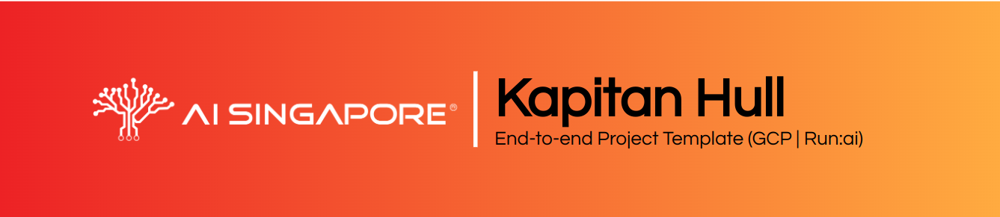

# {{cookiecutter.project_name}}









_{{cookiecutter.description}}_

__A project generated using AI Singpaore's Kapitan Hull, an end-to-end 
ML project template.__

This template that is also accompanied with an end-to-end guide was
generated and customised using the following [`cookiecutter`][ccutter]
template:
https://github.com/aisingapore/kapitan-hull

The contents of the guide have been customised according to the inputs 
provided upon generation of this repository through the usage of 
`cookiecutter` CLI, following instructions detailed [here][kh-readme].

Inputs provided to `cookiecutter` for the generation of this template:

- __`project_name`:__ {{cookiecutter.project_name}}
- __`description`:__ {{cookiecutter.description}}
- __`repo_name`:__ {{cookiecutter.repo_name}}
- __`src_package_name`:__ {{cookiecutter.src_package_name}}
- __`src_package_name_short`:__ {{cookiecutter.src_package_name_short}}
- __`platform`:__ {{cookiecutter.platform}}
- __`orchestrator`:__ {{cookiecutter.orchestrator}}
- __`proj_name`:__ {{cookiecutter.proj_name}}
- __`registry_project_path`:__ {{cookiecutter.registry_project_path}}
- __`author_name`:__ {{cookiecutter.author_name}}

[ccutter]: https://cookiecutter.readthedocs.io/en/stable/
[kh-readme]: https://github.com/aisingapore/kapitan-hull/blob/main/README.md

## Regenerating/Updating from Kapitan Hull

> It is ***strongly recommended*** to push any changes you made to git 
> before running the command to revert back the changes you do not want, 
> especially the model code and the files in the `conf` folder.

If you need to regenerate the scripts from Kapitan Hull to update the 
inputs or to a new version of Kapitan Hull, you can update the 
`cookiecutter.json` with the new inputs and run this command 
within this repository:

```bash
$ cookiecutter --replay-file cookiecutter.json \
    https://github.com/aisingapore/kapitan-hull -o .. -f
```

Add the `-c` parameter to specify the tag/branch you wish to use 
instead.

## End-to-end Guide

This repository contains a myriad of boilerplate codes and configuration
files. On how to make use of these boilerplates, this repository has an 
end-to-end guide on that.  
The guide's contents are written in Markdown formatted files, located
within `aisg-context/guide-site` and its subdirectories. While the
Markdown files can be viewed directly through text editors or IDEs,
the contents are optimised for viewing through [`mkdocs`][mkdocs] (or
[`mkdocs-material`][mkdocs-material] specifically).  
A demo of the site for the guide can be viewed [here][kh-site].

To spin up the site on your local machine, you can create a virtual
environment to install the dependencies first:

```bash
$ conda create -n aisg-kh-guide python=3.11.7
$ conda activate aisg-kh-guide
$ pip install -r aisg-context/guide-site/mkdocs-requirements.txt
```

After creating the virtual environment and installing the required 
dependencies, serve it like so:

```bash
$ mkdocs serve --config-file aisg-context/guide-site/mkdocs.yml
```

The site for the guide should then be viewable on
[`http://localhost:8000`][lhost].

[mkdocs]: https://www.mkdocs.org
[mkdocs-material]: https://squidfunk.github.io/mkdocs-material
[kh-site]: https://aisingapore.github.io/kapitan-hull
[lhost]: http://localhost:8000