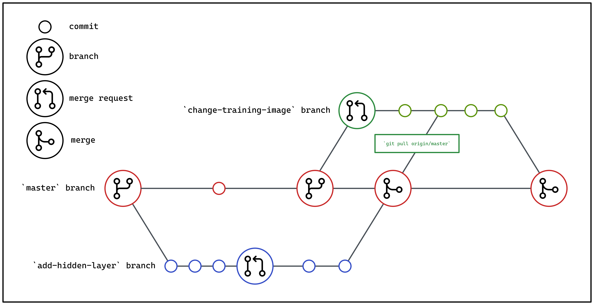

# Continuous Integration & Deployment

This template presents users with a base configuration for a GitLab
 CI/CD pipeline. In this section, the guide aims to provide readers
with some basic understanding of the pipeline defined in the
configuration file `.gitlab-ci.yml`.

That being said, readers would certainly benefit from reading up on
[introductory CI/CD concepts][cicd-intro] as introduced by GitLab's 
Docs.

<div class="video-wrapper">
  <iframe width="1280" height="720" src="https://www.youtube.com/embed/l5705U8s_nQ?start=392" title="YouTube video player" frameborder="0" allow="accelerometer; autoplay; clipboard-write; encrypted-media; gyroscope; picture-in-picture" allowfullscreen></iframe>
</div>

[cicd-intro]: https://docs.gitlab.com/ee/ci/introduction/

## GitHub Flow

The defined pipeline assumes a GitHub flow which only relies on feature 
branches and a `main` (default) branch.



With reference to the diagram above, we have the following pointers:

- We make use of feature branches (`git checkout -b <NAME_OF_BRANCH>`) 
  to introduce changes to the source.
- Merge requests are made when we intend to merge the commits made to a
  feature branch to `main`.
- While one works on a feature branch, it is recommended that changes
  pushed to the `main` are pulled to the feature branch itself on a
  consistent basis. This allows the feature branch to possess the
  latest changes pushed by other developers through their own feature
  branches. In the example above, commits from the `main` branch
  following a merge of the `add-hidden-layer` branch are pulled into
  the `change-training-image` branch while that branch still expects
  further changes.
- The command `git pull` can be used to pull and sync these changes. 
  However, it's recommended that developers make use of `git fetch` and 
  `git log` to observe incoming changes first rather than pulling in 
  changes in an indiscriminate manner.
- While it's possible for commits to be made directly to the `main` 
  branch, it's recommended that they are kept minimal, at least for 
  GitHub flow _(other workflows might not heed such practices)_.

As we move along, we should be able to relate parts of the flow
described above with the stages defined by the default GitLab CI
pipeline.

For more information on Gitlab CI pipeline, you can refer 
[here][lighthouse] (AISG personnel only).

[lighthouse]: https://lighthouse.aisingapore.net/tools-and-tech/Gitlab-CICD

## Environment Variables

Before we can make use of the GitLab CI pipeline, we would have to
define the following variable(s) for the pipeline beforehand:


- `HARBOR_ROBOT_CREDS_JSON`: A JSON formatted value that contains
  encoded credentials for a robot account on Harbor. This is to allow
  the pipeline to interact with the Harbor server. See the next section 
  on how to generate this value/file.  


- `GCP_SERVICE_ACCOUNT_KEY`: A JSON formatted value that contains 
  encoded credentials for a service account on your GCP project. This 
  is to allow the pipeline to interact with the Google Artifact 
  Registry. See [here][gcp-sa] on how to generate this file.  

  After you've generated the JSON file, please encode the file content 
  using `base64 -i <file>`. Afterwhich, copy paste the encoded value 
  and define it as a CI/CD variable. 

To define CI/CD variables for a project (repository), follow the steps
listed [here][cicd-var]. 

The environment variable `HARBOR_ROBOT_CREDS_JSON` needs to be a 
`variable` type.

The environment variable `GCP_SERVICE_ACCOUNT_KEY` needs to be a 
`variable` type.


After defining the CI/CD variables for the project, your pipeline
should be able to pass. If not, re-run the pipeline.

[cicd-var]: https://docs.gitlab.com/ee/ci/variables/#define-a-cicd-variable-in-the-ui

[gcp-sa]: https://cloud.google.com/iam/docs/keys-create-delete



### Docker Configuration File for Accessing Harbor

The variable `HARBOR_ROBOT_CREDS_JSON` will be used to populate the
files `/kaniko/.docker/config.json` and `/root/.docker/config.json` for
`kaniko` and `crane` to authenticate themselves before communicating
with AI Singapore's Harbor registry. You may create the JSON file like
so:

=== "Linux/macOS"

    ```bash
    echo -n <HARBOR_USERNAME>:<HARBOR_PASSWORD> | base64
    ```

=== "Windows PowerShell"

    ```powershell
    $Env:cred = "<HARBOR_USERNAME>:<HARBOR_PASSWORD>"
    $Env:bytes = [System.Text.Encoding]::ASCII.GetBytes($cred)
    $Env:base64 = [Convert]::ToBase64String($bytes)
    echo $base64
    ```

Using the output from above, copy and paste the following content
into a CI/CD environment variable of type `File`
(under `Settings` -> `CI/CD` -> `Variables` -> `Add variable`):

```json
{
    "auths": {
        "registry.aisingapore.net": {
            "auth": "<ENCODED_OUTPUT_HERE>"
        }
    }
}
```


After defining the CI/CD Variables for the project, your pipeline 
should be able to pass. If not, re-run the pipeline. 

??? info "Reference Link(s)"

    - [GitLab Docs - GitLab CI/CD variables](https://docs.gitlab.com/ee/ci/variables/)
    - [Docker Docs - Configuration files](https://docs.docker.com/engine/reference/commandline/cli/#configuration-files)



## Stages & Jobs

In the default pipeline, we have 3 stages defined:

- `test`: For every push to certain branches, the source code residing
  in `src` will be tested.
- `deploy-docs`: This stage is for the purpose of deploying a static
  site through [GitLab Pages]. More on this stage is covered in 
  ["Documentation"](./10-documentation.md).
- `build`: Assuming the automated tests are passed, the pipeline
  will build Docker images, making use of the latest source.

These stages are defined and listed like so:

=== "`.gitlab-ci.yml`"

    ```yaml
    ...
    stages:
      - build
      - test
      - deploy
      - deploy-docs
    ...
    ```

The jobs for each of the stages are executed using Docker images 
defined by users. For this, we have to specify in the pipeline the tag
associated with the GitLab Runner that has the [Docker executor]. 

The `on-prem` tag calls for runners within our on-premise 
infrastructure so on-premise services can be accessed within our 
pipelines.

The `gcp` tag calls for runners on our GCP infrastructure so it can use
the GCP services within our pipelines.


The `./conda` folder generated from creating the Conda environment is 
then cached and to be used for other jobs, saving time from rebuilding 
the environment in every job that requires it. The 
`$CI_COMMIT_REF_SLUG` key refers to the branch name modified to be 
code-friendly. In this case, it is used as a namespace to store all the
files that is cached within this branch.

=== "`.gitlab-ci.yml`"

    ```yaml
    default:
      tags:

        - on-prem

        - gcp

    ...
    ```

[Gitlab Pages]: https://docs.gitlab.com/ee/user/project/pages
[Docker executor]: https://docs.gitlab.com/runner/executors/docker.html 


## Variables

The GitLab CI pipeline uses several variables to control its behavior:

- `PYTHON_IMAGE`: Specifies the Docker image used for Python-based jobs (default: `continuumio/miniconda3:24.7.1-0`)
- `VENV_DIRECTORY`: Defines the path where the Conda environment will be created and stored
- `IMAGE_TAG`: Default tag for Docker images (default: `latest`)

- `BUILD_CONDA`: When set in a manual pipeline run, forces the Conda environment to be built
- `BUILD_ALL`: When set in a manual pipeline run, triggers building of all Docker images
- `BUILD_DATAPREP`: When set in a manual pipeline run, triggers building of the data preparation image
- `BUILD_MODEL`: When set in a manual pipeline run, triggers building of the model training image


GitLab also provides many predefined variables that are used in the pipeline:
- `CI_COMMIT_REF_SLUG`: Branch or tag name in a URL-friendly format
- `CI_COMMIT_SHORT_SHA`: The first 8 characters of the commit SHA
- `CI_DEFAULT_BRANCH`: The default branch for the project (usually `main`)
- `CI_PIPELINE_SOURCE`: How the pipeline was triggered (e.g., "push", "web", "merge_request_event")

- `CI_PROJECT_DIR`: The full path where the repository is cloned
- `CI_MERGE_REQUEST_IID`: The merge request ID if the pipeline is for a merge request
- `CI_COMMIT_TAG`: The commit tag name if the pipeline was triggered by a tag

## Building the Conda Environment

Let's look at the job defined for the `build` stage first:

=== "`.gitlab-ci.yml`"

    ```yaml
    ...
    build:conda-env:
      stage: build
      image:
        name: ${PYTHON_IMAGE}
      script:
        - conda env create -f {{cookiecutter.repo_name}}-conda-env.yaml -p ${VENV_DIRECTORY}
      rules:
        - if: $CI_MERGE_REQUEST_IID
          changes:
            - {{cookiecutter.repo_name}}-conda-env.yaml
        - if: $CI_PIPELINE_SOURCE == "push"
          changes:
            - {{cookiecutter.repo_name}}-conda-env.yaml
        - if: $CI_PIPELINE_SOURCE == "web"
          changes:
            - {{cookiecutter.repo_name}}-conda-env.yaml
        - if: $CI_PIPELINE_SOURCE == "web" && $BUILD_CONDA
        - if: $CI_COMMIT_TAG
          when: never
      needs: []
    ...
    ```

First of all, this `build:conda-env` job will only execute on the
condition that the defined [`rules`][cicd-rules] are met. In this case,
the job will only execute for the following cases:

- For pushes to branches which merge requests have been created, tests
  are executed only if changes made to the 
  `{{cookiecutter.repo_name}}-conda-env.yaml` are detected. This is to 
  prevent automated tests from running for pushes made to feature 
  branches with merge requests when  no changes have been made to files 
  for which tests are relevant. Otherwise, tests will run in a 
  redundant manner, slowing down the feedback loop.
- For any pushes to any branch.
- For any manual pipeline execution through GitLab's web UI.
- If the push action is associated with a tag
  (`git push <remote> <tag_name>`), the job will not run.

The job does not have any jobs that it needs to wait for, thus the 
`needs` section is populated with `[]`.

[cicd-rules]: https://docs.gitlab.com/ee/ci/yaml/#rules

## Automated Testing & Linting

The `test` stage includes two separate jobs: one for linting and one for running tests:

=== "`.gitlab-ci.yml` - Linting Job"

    ```yaml
    ...
    test:lint:
      stage: test
      before_script:
        - source activate ${VENV_DIRECTORY}
        - pip install -r dev-requirements.txt
      script:
        - pylint src --fail-under=7.0 --ignore=tests --disable=W1202
      rules:
        - if: $CI_MERGE_REQUEST_IID
          changes:
            - src/**/*
            - conf/**/*
        - if: $CI_PIPELINE_SOURCE == "push"
        - if: $CI_PIPELINE_SOURCE == "web"
        - if: $CI_COMMIT_TAG
          when: never
      needs:
        - job: build:conda-env
          optional: true
    ...
    ```

=== "`.gitlab-ci.yml` - Testing Job"

    ```yaml
    ...
    test:pytest:
      stage: test
      before_script: 
        - source activate ${VENV_DIRECTORY}
        - pip install -r dev-requirements.txt
      script:
        - pytest src/tests --junitxml=./rspec.xml
      rules:
        - if: $CI_MERGE_REQUEST_IID
          changes:
            - src/**/*
            - conf/**/*
        - if: $CI_PIPELINE_SOURCE == "push"
        - if: $CI_PIPELINE_SOURCE == "web"
        - if: $CI_COMMIT_TAG
          when: never
      artifacts:
        paths:
          - rspec.xml
        reports:
          junit: rspec.xml
      needs:
        - job: build:conda-env
          optional: true
    ...
    ```

For both the `test:lint` and `test:pytest` jobs, they will only execute for the following cases:

- For pushes to branches which merge requests have been created, tests
  are executed only if changes made to any files within `src` or `conf` 
  are detected.
- For any pushes to any branch.
- For any manual pipeline execution through GitLab's web UI.
- If the push action is associated with a tag
  (`git push <remote> <tag_name>`), the job will not run.

Both jobs wait for `build:conda-env` to be completed first before they 
can be executed. The `optional: true` option is set so that they would 
still run if the `build:conda-env` job doesn't since the environment 
has already been cached to be used in these jobs.

The `test:lint` job fails if the source code does not meet a linting 
score of at least 7.0.

The `test:pytest` job fails if the source code fails any tests that 
have been defined under `src/tests`. This job generates a `rspec.xml` 
file as an artifact so that you can read the test results in the GitLab 
UI. More information about this can be found [here][unittests].

Both jobs would have to succeed before moving on to the `deploy` stage.
Otherwise, no Docker images will be built. This is so that source
code that fails either linting or tests would never be packaged.

??? info "Reference Link(s)"

    - [GitLab Docs - Predefined variables reference](https://docs.gitlab.com/ee/ci/variables/predefined_variables.html)
    - [Real Python - Effective Python Testing With Pytest](https://realpython.com/pytest-python-testing/)
    - [VSCode Docs - Linting Python in Visual Studio Code](https://code.visualstudio.com/docs/python/linting)

[unittests]: https://docs.gitlab.com/ee/ci/testing/unit_test_reports.html

## Automated Builds

The template has thus far introduced a couple of Docker images relevant
for the team. The tags for all the Docker images are listed below:

- `{{cookiecutter.registry_project_path}}/cpu`
- `{{cookiecutter.registry_project_path}}/gpu`

The `deploy` stage aims at automating the building of these Docker
images in a parallel manner. Let's look at a snippet for a single job
that builds a Docker image:

=== "`.gitlab-ci.yml`"

    ```yaml
    ...
    build:cpu-image:
      stage: deploy
      image:
        name: gcr.io/kaniko-project/executor:debug
        entrypoint: [""]

        variables:
          GOOGLE_APPLICATION_CREDENTIALS: /kaniko/.docker/config.json

      before_script:

        - "[[ -z ${HARBOR_ROBOT_CREDS_JSON} ]] && echo 'HARBOR_ROBOT_CREDS_JSON variable is not set.' && exit 1"

        - "[[ -z ${GCP_SERVICE_ACCOUNT_KEY} ]] && echo 'GCP_SERVICE_ACCOUNT_KEY variable is not set.' && exit 1"

      script:
        - mkdir -p /kaniko/.docker

        - cat $HARBOR_ROBOT_CREDS_JSON > /kaniko/.docker/config.json

        - cat $GCP_SERVICE_ACCOUNT_KEY > /kaniko/.docker/config.json

        - >-
          /kaniko/executor
          --context "${CI_PROJECT_DIR}"
          --dockerfile "${CI_PROJECT_DIR}/docker/{{cookiecutter.repo_name}}-cpu.Dockerfile"
          --destination "{{cookiecutter.registry_project_path}}/cpu:${CI_COMMIT_SHORT_SHA}"
      rules:
        - if: $CI_MERGE_REQUEST_IID
          changes:
            - docker/{{cookiecutter.repo_name}}-cpu.Dockerfile
            - src/**/*
            - conf/**/*
        - if: $CI_COMMIT_BRANCH == $CI_DEFAULT_BRANCH
        - if: $CI_PIPELINE_SOURCE == "web" && $BUILD_ALL
        - if: $CI_PIPELINE_SOURCE == "web" && $BUILD_DATAPREP
      needs:
        - job: test:lint
          optional: true
        - job: test:pytest
          optional: true
    ...
    ```

!!! note
    You would have noticed that the jobs for building images utilise the
    command `/kaniko/executor` as opposed to `docker build` which most
    users would be more familiar with. This is due to the usage of
    [`kaniko`][kaniko] within a runner with a Docker executor. Using 
    Docker within Docker ([Docker-in-Docker][dind]) requires privileged 
    mode that poses several security concerns. Hence, the image 
    `gcr.io/kaniko-project/executor:debug` is being used for all 
    `deploy` jobs related to building of Docker images. That being said, 
    the flags used for `kaniko` corresponds well with the flags usually 
    used for `docker` commands.

  

  


Before it goes through the job, it will check whether 
`{{jsonfile}}` has been set in the CI/CD variables. 
Otherwise, it will prematurely stop the job with the error, preventing 
the job from running any further and freeing the CI worker faster to 
work on other jobs in the organisation.

Just like with the `test` jobs, the each of the jobs under `deploy` will
execute under certain conditions:

- If a push is being done to a branch which has a merge request opened,
  a check would be done to see if any changes were made to folders like
  `src`, `conf`, `scripts`, or the relevant Dockerfile itself. If there
  are changes, the job will be executed. An opened merge request is
  detected through the predefined variable `CI_MERGE_REQUEST_IID`.
- If a push is being made to the default branch (`CI_DEFAULT_BRANCH`)
  of the repo, which in most cases within our organisation would be 
  `main`, the job would execute as well. Recalling the `test` stage, 
  any pushes to the repo would trigger the automated tests and linting. 
  If a push to the `main` branch passes the tests, all Docker images 
  will be built, regardless of whether changes have been made to files
  relevant to the Docker images to be built themselves.
- For any manual pipeline execution through GitLab's web UI that has 
  either `BUILD_ALL` or `BUILD_DATAPREP` (or `BUILD_MODEL` for the 
  model training image) variable has been set. It can be set to any 
  value, but we can set it to `true` by default.

The jobs in the `deploy` stage requires the `test:lint` and 
`test:pytest` jobs to be successful, otherwise it would not run.

Images built through the pipeline will be tagged with the commit
hashes associated with the commits that triggered it. This is seen
through the usage of the predefined variable `CI_COMMIT_SHORT_SHA`.

??? info "Reference Link(s)"

    - [GitLab Docs - Use kaniko to build Docker images](https://docs.gitlab.com/ee/ci/docker/using_kaniko.html)
    - [GitLab Docs - Use Docker to build Docker images](https://docs.gitlab.com/ee/ci/docker/using_docker_build.html#use-docker-in-docker)

[kaniko]: https://github.com/GoogleContainerTools/kaniko
[dind]: https://docs.gitlab.com/ee/ci/docker/using_docker_build.html#use-docker-in-docker

## Tagging

As mentioned, pushes to the default branch would trigger builds for
Docker images and they would be tagged with the commit hash. However,
such commit hashes aren't the best way to tag "finalised" Docker images
so the usage of tags would be more appropriate here. Hence, for the job
defined below, it would only trigger if a tag is pushed to the default
branch and only the default branch. The tag pushed (`git push <remote> 
<tag>`) to the default branch on the remote would have the runner
__retag__ the Docker image that exists on Harbor with the tag that is
being pushed. The relevant images to be retagged are originally tagged
with the short commit hash obtained from the commit that was pushed to
the default branch before this.

=== "`.gitlab-ci.yml`"

    ```yaml
    ...
    build:retag-images:
      stage: deploy
      image:

        name: gcr.io/go-containerregistry/crane:debug
        entrypoint: [""]

        name: google/cloud-sdk:debian_component_based
      variables:
        GOOGLE_APPLICATION_CREDENTIALS: /gcp-sa.json

      before_script:

        - "[[ -z ${HARBOR_ROBOT_CREDS_JSON} ]] && echo 'HARBOR_ROBOT_CREDS_JSON variable is not set.' && exit 1"

        - "[[ -z ${GCP_SERVICE_ACCOUNT_KEY} ]] && echo 'GCP_SERVICE_ACCOUNT_KEY variable is not set.' && exit 1"

      script:

        - cat $HARBOR_ROBOT_CREDS_JSON > /root/.docker/config.json
        - crane tag {{cookiecutter.registry_project_path}}/cpu:${CI_COMMIT_SHORT_SHA} ${CI_COMMIT_TAG}
        - crane tag {{cookiecutter.registry_project_path}}/gpu:${CI_COMMIT_SHORT_SHA} ${CI_COMMIT_TAG}

        - cat $GCP_SERVICE_ACCOUNT_KEY > /gcp-sa.json
        - gcloud container images add-tag "{{cookiecutter.registry_project_path}}/cpu:${CI_COMMIT_SHORT_SHA}" "{{cookiecutter.registry_project_path}}/cpu:${CI_COMMIT_TAG}"
        - gcloud container images add-tag "{{cookiecutter.registry_project_path}}/gpu:${CI_COMMIT_SHORT_SHA}" "{{cookiecutter.registry_project_path}}/gpu:${CI_COMMIT_TAG}"

      rules:
        - if: $CI_COMMIT_TAG && $CI_COMMIT_BRANCH == $CI_DEFAULT_BRANCH
      needs:
        - job: build:cpu-image
          optional: true
        - job: build:gpu-image
          optional: true
    ...
    ```

??? info "Reference Link(s)"

    - [GitHub Docs - GitHub Flow](https://docs.github.com/en/get-started/quickstart/github-flow)
    - [GitLab Docs - GitLab Flow](https://docs.gitlab.com/ee/topics/gitlab_flow.html)
    - [`go-containerregistry` GitHub - `crane`](https://github.com/google/go-containerregistry/blob/main/cmd/crane/README.md)


## Conclusion

The stages and jobs defined in this default pipeline is rudimentary at
best as there is much more that could be done with GitLab CI. Some
examples off the top:

- automatically generate reports for datasets that arrive in regular
  intervals
- submit model training jobs following triggers invoked by the same
  pipeline
- automate the deployment of the FastAPI servers to Kubernetes clusters

There's much more that can be done but whatever has been shared thus 
far is hopefully enough for one to get started with CI/CD. 

Maintaining CI/CD pipelines requires extensive effort from developers. 
To reduce the effort required from developers, the MLOps Team has 
written a set of templates in which users can implement - plug and play 
with [CI/CD Components][cicdcomp].

[cicdcomp]: https://lighthouse.aisingapore.net/Platforms/MLOps&LLMOps/CICD-Components
