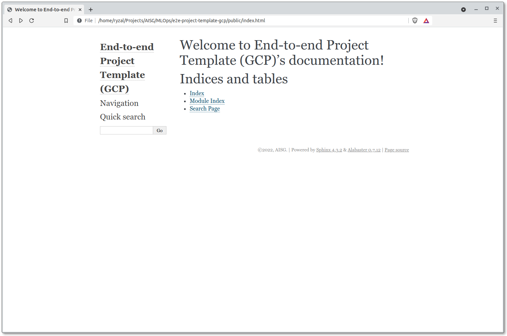

# Documentation

The boilerplate packages generated by the template are populated with
some [NumPy formatted docstrings][numpy]. What we can do with this is 
to observe how documentation can be automatically generated using
[Sphinx], with the aid of the [Napoleon] extension. Let's build the 
HTML asset for the documentation:

```bash
# From the root folder
conda activate {{cookiecutter.repo_name}}
sphinx-apidoc -f -o docs src
sphinx-build -b html docs public
```

Open the file `public/index.html` with your browser and you will be
presented with a static site similar to the one shown below:



Browse through the site and inspect the documentation that was
automatically generated through Sphinx.

[numpy]: https://numpydoc.readthedocs.io/en/latest/format.html#docstring-standard
[Sphinx]: https://www.sphinx-doc.org/en/master/
[Napoleon]: https://www.sphinx-doc.org/en/master/usage/extensions/napoleon.html

## GitLab Pages

Documentation generated through Sphinx can be served on [GitLab Pages], 
through GitLab CI/CD. With this template, a default CI job has been 
defined in `.gitlab-ci.yml` to serve the Sphinx documentation when 
pushes are done to the `main` branch:

```yaml
...
pages:
  stage: deploy-docs
  before_script:
    - source activate ${VENV_DIRECTORY}
    - pip install -r docs-requirements.txt
    - pip install -r aisg-context/guide-site/mkdocs-requirements.txt
  script:
    - sphinx-apidoc -f -o docs src
    - sphinx-build -b html docs public
    - mkdocs build -v -f aisg-context/guide-site/mkdocs.yml -d $PWD/public/guide
  artifacts:
    paths:
    - public
  rules:
    - if: $CI_COMMIT_BRANCH == "main"
      changes:
        - docs/**/*
        - src/**/*
        - aisg-context/guide-site/**/*
  needs:
    - job: build:conda-env
      optional: true
...
```

The documentation page is viewable through the following convention:

`<NAMESPACE>.gitlab.aisingapore.net/<PROJECT_NAME>` or
`<NAMESPACE>.gitlab.aisingapore.net/<GROUP>/<PROJECT_NAME>`.

`<NAMESPACE>.gitlab.example.com/<PROJECT_NAME>` or
`<NAMESPACE>.gitlab.example.com/<GROUP>/<PROJECT_NAME>`.


??? info "Reference Link(s)"

    - [GitLab Docs - Pages domain names, URLs, and base URLs](https://docs.gitlab.com/ee/user/project/pages/getting_started_part_one.html)
    - [GitLab Docs - Namespaces](https://docs.gitlab.com/ee/user/group/#namespaces)

[GitLab Pages]: https://docs.gitlab.com/ee/user/project/pages/