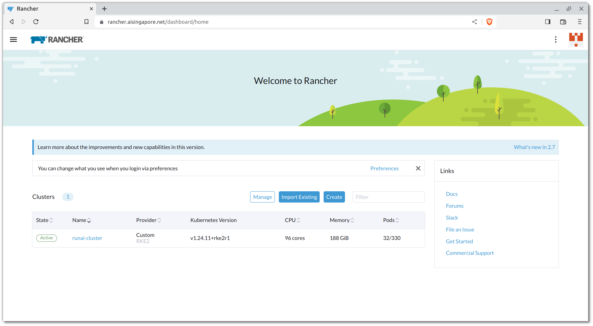
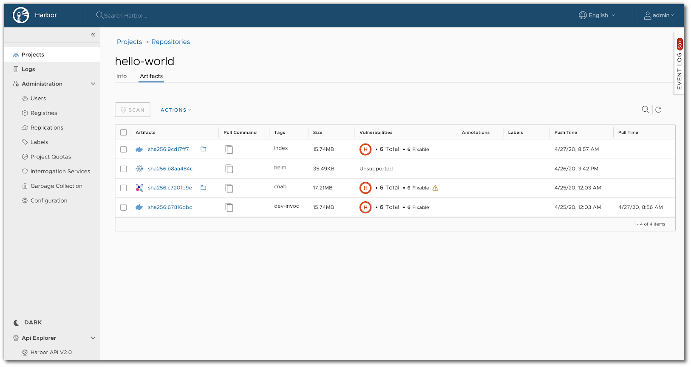
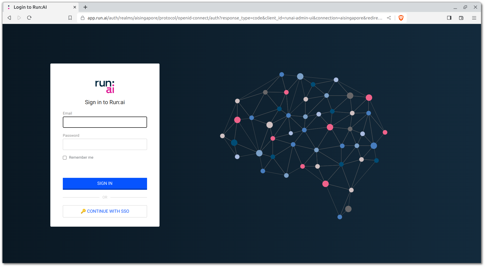
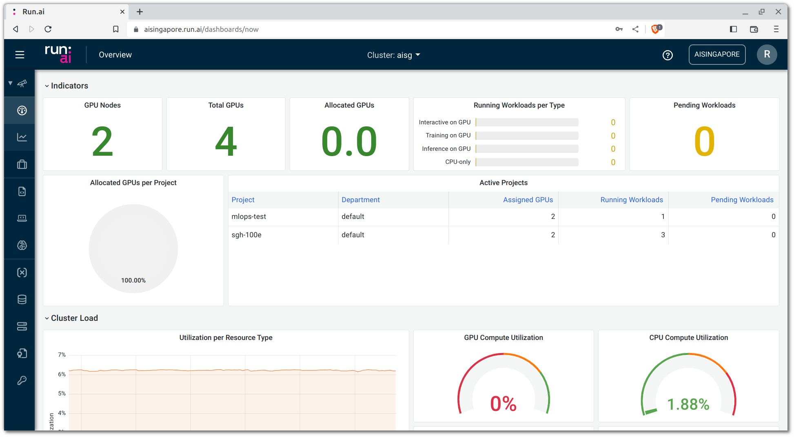
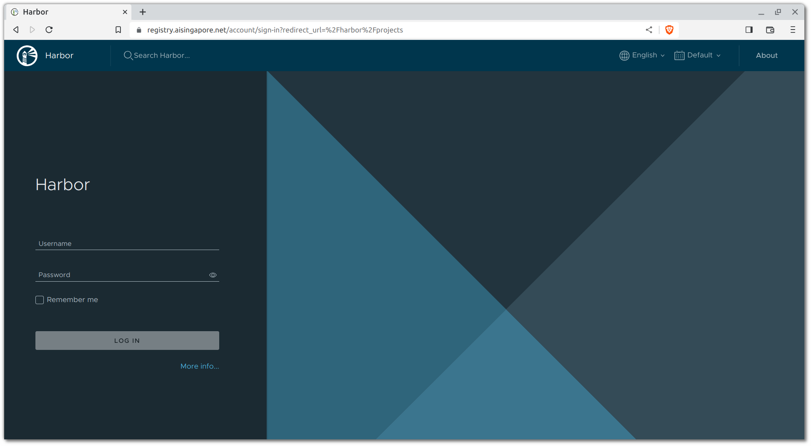
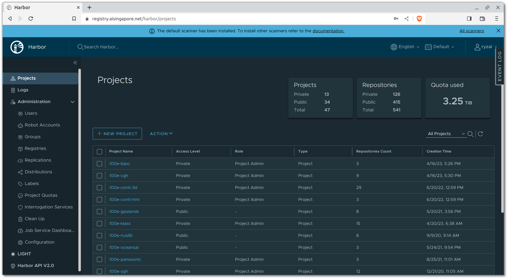
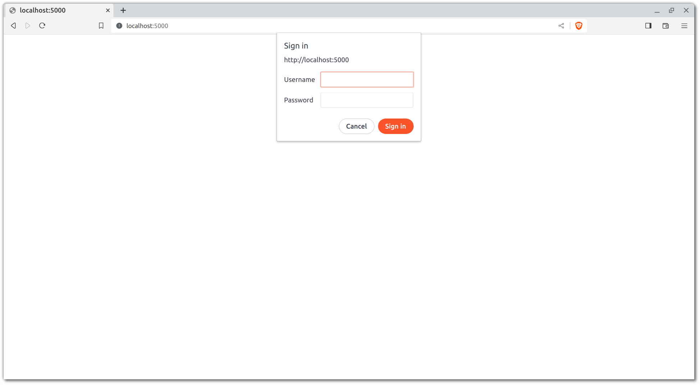
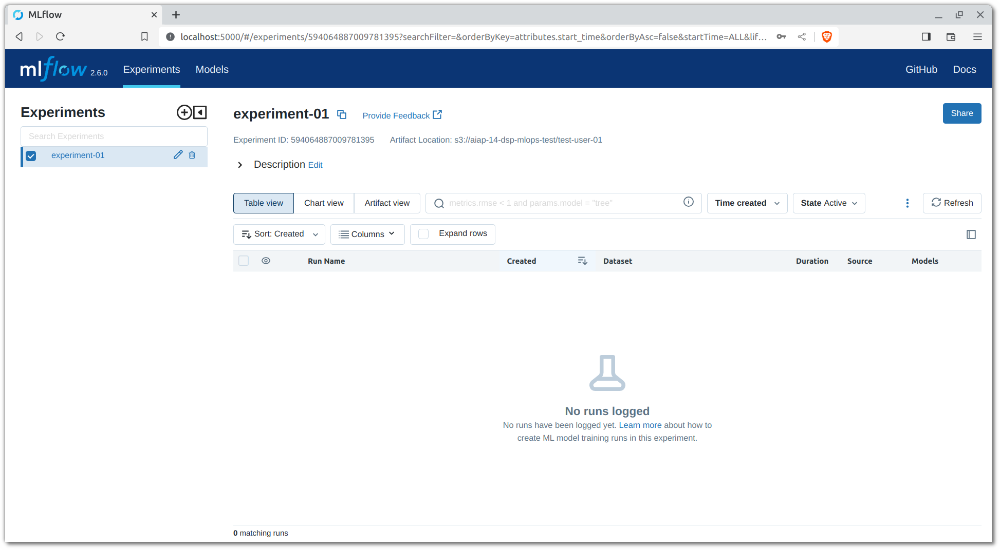
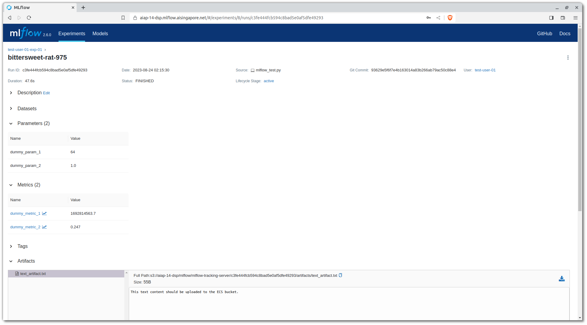

# MLOps Components & Platform

The aim for this section is to deliver the following:

- An overview of the various MLOps components that we will be
  interacting with for the rest of the guide, as well as an overview for
  each of the components.
- A summary of the service(s) and tool(s) of choice for some components,
  and an access quickstart for each of them.

## NUS VPN

Your credentials for your NUS Staff/Student account is needed to
login to NUS' VPN for access to the following:

- [AI Singapore's GitLab instance](#gitlab)
- [AI Singapore's Kubernetes clusters](#kubernetes)
- [AI Singapore's Run:ai platform](#runai)
- [AI Singapore's Harbor registry](#harbor)
- [AI Singapore's Elastic Cloud Storage (ECS)](#elastic-cloud-storage-ecs)
- [Your project's on-premise MLflow Tracking server](#mlflow)
- Other miscellaneous NUS resources

## Kubernetes

Before we dive into the different MLOps components that you will be
interacting with in the context of this guide, we have to first
introduce
[Kubernetes](https://kubernetes.io/)
as the underlying orchestration tool to execute
pipelines and manage containerised applications and environments.

From the Kubernetes site:

> _Kubernetes, also known as K8s, is an open-source system for automating_
> _deployment, scaling, and management of containerized applications._
> _It groups containers that make up an application into logical units_
> _for easy management and discovery._

A number of services and applications that you will be interacting with
(or deploying) are deployed (to be deployed) within a Kubernetes
cluster. Some of the MLOps components which the Kubernetes cluster(s)
will be relevant for are:

- Developer Workspace
- Data Experimentation
- Model Training & Evaluation
- Experiment & Pipeline Tracking
- Model Serving

These components will be further elaborated in the upcoming sections.

??? info "Reference Link(s)"

    - [IBM - What is Kubernetes?](https://www.ibm.com/topics/kubernetes)

### Rancher

Upon one's assignment to a project, any relevant clusters that one has
access to would be viewable on
[AI Singapore's Rancher dashboard](https://rancher.aisingapore.net).



[Rancher](https://www.rancher.com) is a Kubernetes management platform
that provides cluster administrators or users to manage Kubernetes
clusters or facilitate Kubernetes workflows.
To login, use your Azure account i.e. the same set of credentials that
you use for your GitLab account.

!!! note
    If you do not have rightful access to a cluster, please notify the
    MLOps team at `mlops@aisingapore.org`.

### Kubernetes VS Rancher VS Run:ai

One might be confused as to how each of the aforementioned tools and
platforms differ from each other. To put it simply, Kubernetes lies
underneath the Rancher and Run:ai platform/interface. Rancher and Run:ai
are abstraction layers on top of Kubernetes; they both
essentially communicate with the
[Kubernetes API server](https://kubernetes.io/docs/concepts/overview/kubernetes-api)
to carry out actions or orchestrate workloads through each of their own
interface.

Developers can use Rancher's interface or Run:ai's interface/CLI to
spin up workspaces, jobs or deploy applications. However, the latter can
better serve machine learning engineers in carrying out their machine
learning workflows as that was the intended usage of the platform.
Besides, Run:ai's unique selling point is its better utilisation of
GPU resources (through fractionalisation and other features)
so when it comes to workloads that require GPU, like
model training and evaluation, the usage of Run:ai is recommended.
Also, on the surface, it is easier for one to spin up developer
workspaces on Run:ai.

??? info "Reference Link(s)"

    - [Rancher Docs - Rancher Server and Components](https://ranchermanager.docs.rancher.com/reference-guides/rancher-manager-architecture/rancher-server-and-components)
    - [Run:ai Docs - System Components](https://docs.run.ai/home/components)

## MLOps Components

The diagram below showcases the some of the components that this guide
will cover as well as how each of them relate to each other.

[](assets/aisg-e2e-mlops-workflow-components_jul2023.html)

!!! note
    Click on the image above for an interactive view of the diagram.
    You may interact with the layers to view the components in a
    sequential manner.

### Developer Workspace

Developers begin by having the client (laptop/VM) to be authenticated by
whichever platform they have been provided access to.

- Developers with access to Google Cloud projects would have to
  authenticate through the `gcloud` CLI which allows them to access the
  Google Kubernetes Engine (GKE) cluster, which in turn would allow them
  access to the default orchestration platform, Polyaxon.
- Developers with access to AI Singapore’s on-premise clusters would
  have to authenticate through the default orchestration platform that
  runs on top of the on-premise Kubernetes clusters, Run:ai.
  This is done through Run:ai’s CLI.

__Following authentication, developers can make use of templates__
provided by the MLOps team __to spin up developer workspaces__
([VSCode server](https://github.com/coder/code-server),
[JupyterLab](https://jupyter.org/), etc.) on the respective platforms.
Within these developer workspaces, developers can work on their
codebase, execute light workloads, and carry out other steps of the
end-to-end machine learning workflow.

A typical machine learning or AI project would require the team to carry
out exploratory data analysis (EDA) on whatever domain-specific data is
in question. This __work is expected to be carried out within the
development workspace with the assistance of virtual environment
managers__.

??? info "Reference Link(s)"

    - [Run:ai Docs - Workspaces Introduction](https://docs.run.ai/v2.13/Researcher/user-interface/workspaces/overview)

### Version Control

Within a developer workspace and environment, developers can interact
(pull, push, etc.) with AI Singapore’s
[__GitLab__](https://about.gitlab.com) instance,
which serves as __the organisation’s default version control (Git)
remote server__.

??? info "Reference Link(s)"

    - [Atlassian Tutorials - What is Git?](https://www.atlassian.com/git/tutorials/what-is-git)

### Continuous X

GitLab also serves as a DevOps platform where the Continuous X of things
(Continuous Integration, Continuous Delivery, etc.) can be implemented
and automated. This is done through
[GitLab CI/CD](https://docs.gitlab.com/ee/ci).
Interactions made with
repositories on GitLab can be made to trigger CI/CD workflows. The
__purpose of such workflows are to facilitate the development lifecycle
and streamline the process of delivering quality codebase__.

- The workflows at the very least should include unit and integration
  testing where the __codebase is subjected to tests and linting tools
  to ensure that best practices and conventions are adhered to__ by
  contributors from the project team. This is known as
  __Continuous Integration (CI)__.
- Another important aspect is __Static Application Security Testing
  (SAST)__ where application security tools are utilised to __identify
  any vulnerabilities that exist within the codebase__.
- GitLab CI/CD can also __invoke interactions with other MLOps
  components__ such as submitting jobs
  (model training, data processing, etc.) to the
  aforementioned orchestration platforms or even deploy applications.
  This fulfils the __Continuous Delivery (CD)__ and
  __Continuous Training (CT)__ portion.

<iframe width="1280" height="315" src="https://www.youtube.com/embed/1P3eDs9Zzyk" title="YouTube video player" frameborder="0" allow="accelerometer; autoplay; clipboard-write; encrypted-media; gyroscope; picture-in-picture; web-share" allowfullscreen></iframe>

??? info "Reference Link(s)"

    - [ml-ops.org - Continuous X](https://ml-ops.org/content/mlops-principles#continuous-x)
    - [Google Cloud - MLOps: Continuous delivery and automation pipelines in machine learning](https://cloud.google.com/architecture/mlops-continuous-delivery-and-automation-pipelines-in-machine-learning)
    - [GitLab - What is DevOps?](https://about.gitlab.com/topics/devops)

### Container Image Registry

AI Singapore has a strong __emphasis on containerising pipelines for the
purpose of reproducibility and ease of delivery__. Images built through
CI/CD workflows or manual builds can be pushed to container image
registries, be it Google Cloud’s
[Artifact Registry](https://cloud.google.com/artifact-registry)
or AI Singapore’s on-premise [Harbor](https://goharbor.io) registry.


<p style="text-align: center;"><i>Harbor Registry</i></p>

??? info "Reference Link(s)"

    - [Red Hat - What is a container registry?](https://www.redhat.com/en/topics/cloud-native-apps/what-is-a-container-registry)

### Data Preparation

Following the EDA phase, the project team would map out and work on data
processing and preparation pipelines. These pipelines would __first be
developed with manual invocation__ in mind but a team can __strive towards
automating the processes__ where the pipelines can be triggered by the
CI/CD workflows that they would have defined.

As the quality of data to be used for training the models is important,
components like __data preparation can be prefaced with
data validation__, where checks are done to __examine the data’s
adherence to conventions and standards__ set by the stakeholders of the
project.

### Model Training & Evaluation

Once the project team is more familiar with the domain-specific data
and data preparation pipelines have been laid, they can look into model
training and evaluation.

When working towards a base model or a model that can be settled as the
Minimum Viable Model (MVM), a lot of experimentations would have to be
done as part of the model training process. Part of such __experiments
includes parameter tuning__ where a search space is iterated through to
find the best set of configurations that optimises the model’s
performance or objectives. Tools like
[Optuna](https://optuna.org) can greatly assist in facilitating such
workflows.

### Experiment & Pipeline Tracking

As there would be a myriad of experiments to be carried out, __there is
a need for the configurations, results, artefacts, and any other
relevant metadata of every experiment to be logged and persisted__.
Purpose of tracking such information would __allow for easy comparison__
of models’ performances and if there is a need to
__reproduce experiments__, relevant information can be referred back.
__With the right information__, metadata and utilisation of containers
for reproducible workflows, __pipelines can be tracked as well__.
Carrying these out would provide a team with a __model
registry__ of sorts where experiments with tagged models can be referred
to when they are to be deployed and served.

A tool with relevant features would be [MLflow](https://mlflow.org/).

<iframe width="1280" height="315" src="https://www.youtube.com/embed/5CpaimNhMzs" title="YouTube video player" frameborder="0" allow="accelerometer; autoplay; clipboard-write; encrypted-media; gyroscope; picture-in-picture; web-share" allowfullscreen></iframe>

??? info "Reference Link(s)"

    - [Databricks Blog - Introducing MLflow: an Open Source Machine Learning Platform](https://www.databricks.com/blog/2018/06/05/introducing-mlflow-an-open-source-machine-learning-platform.html)

### Model Serving

With the models that have been trained, applications that allow for
end-users to interact with the model can be deployed on test
environments. __Deployment of models__ can be and are conventionally
done by using __API frameworks__. However, not all problem statements
require such frameworks and scripts for executing __batch inference
might suffice in some cases__.

One of the popular Python frameworks for building APIs is
[FastAPI](https://fastapi.tiangolo.com). It is easy to pick up and has
many useful out-of-the-box features.

??? info "Reference Link(s)"

    - [Ubuntu Blog - A guide to ML model serving](https://ubuntu.com/blog/guide-to-ml-model-serving)

## GitLab

We at AI Singapore host our own GitLab server:

> https://gitlab.aisingapore.net

You should
be provided with a set of credentials during onboarding for access to
the server.

In order to interact with remote Git repositories situated on
AI Singapore's GitLab instance (clone, push, fetch, etc.)
outside of NUS' network or GCP (regions `asia-southeast1` and
`us-central1`), you would need to login to NUS' VPN.

### Push & Pull with HTTPS VS SSH

The usage of either the HTTPS or SSH protocol for communicating with
the GitLab server depends on the environment in question. If an
environment is made accessible by multiple developers, then HTTPS-based
access where passwords are prompted for would be better fitting.
SSH-based access would be more fitting for clients that are more
isolated like a single Linux user or local machines made accessible by
a single owner.

If you would like to configure SSH access for accessing AI Singapore's
GitLab instance, you can add the following lines to your SSH
configuration file (`~/.ssh/config`):

```config
Host gitlab.aisingapore.net
    Port 2222
    IdentityFile ~/.ssh/<PATH_TO_PRIVATE_KEY>
```

??? info "Reference Link(s)"

    - [GitLab Docs - Use SSH keys to communicate with GitLab](https://docs.gitlab.com/ee/user/ssh.html)

## Run:ai

Run:ai is an enterprise orchestration and cluster management platform
that works as an abstraction layer on top of AI Singapore's hybrid
infrastructure to maximise the usage of such resources. The platform
utilises [Kubernetes](https://kubernetes.io) in the backend.
Orchestration platforms such as Run:ai allows end-users to easily spin
up workloads, execute jobs, set up services or carry out any
interaction with relevant resources.

The video below provides a quick and high-level overview of that the
platform's unique selling point.

<iframe width="1280" height="315" src="https://www.youtube.com/embed/Ss7PYTYbEWw" title="YouTube video player" frameborder="0" allow="accelerometer; autoplay; clipboard-write; encrypted-media; gyroscope; picture-in-picture; web-share" allowfullscreen></iframe>

The entry point for accessing the platform's front-end UI is through the
login page at the following link:

> https://aisingapore.run.ai

The link above will bring you to the login page:



To login, click on `CONTINUE WITH SSO`. You will be redirected to login
with your Azure account. After a successful login, you will
be brought to the platform's home (`Overview`) page.



### Authentication

While one can make use of the platform's front-end UI to interact with
the Kubernetes cluster in the backend, one might be inclined towards the
programmatic approach where a CLI is to be relied on. Run:ai
provides a CLI that can be used to interact with the platform's API.

To use the CLI, you need to be authenticated. For that, you need the
following:

- A Kubernetes configuration file a.k.a `kubeconfig`. This is provided
  by the MLOps team.
- Run:ai CLI to be installed on your local machine (or any client).

#### `kubeconfig`

A client that intends to communicate with a Kubernetes cluster would
have to rely on a configuration file called `kubeconfig`. The
YAML-formatted `kubeconfig` would contain information such as cluster
endpoints, authentication details, as well as any other access
parameters. `kubeconfig` files are relied on by the `kubectl` CLI tool
for information and credentials to access Kubernetes clusters.

In the context of being authenticated with the Run:ai cluster, end-users
would be provided with a `kubeconfig` entailed with the default set of
configuration. While you may place this `kubeconfig` in any (safe)
location within your local machine, a reasonable place to place it
would be the `$HOME/.kube` directory.

??? Example "Here is a sample of how the default `kubeconfig` can look like:"

    ```yaml
    apiVersion: v1
    clusters:
    - cluster:
        insecure-skip-tls-verify: true
        server: https://runai-cluster.aisingapore.net:6443
      name: runai-cluster-fqdn
    contexts:
    - context:
        cluster: runai-cluster-fqdn
        user: runai-authenticated-user
      name: runai-cluster-fqdn
    current-context: runai-cluster-fqdn
    kind: Config
    preferences: {}
    users:
    - name: runai-authenticated-user
      user:
        auth-provider:
          config:
            airgapped: "true"
            auth-flow: remote-browser
            realm: aisingapore
            client-id: runai-cli
            idp-issuer-url: https://app.run.ai/auth/realms/aisingapore
            redirect-uri: https://aisingapore.run.ai/oauth-code
          name: oidc
    ```

To understand more on managing configuration for Kubernetes, do refer
to the reference document below.

??? info "Reference Link(s)"

    - [Kubernetes Docs - Organizing Cluster Access Using kubeconfig Files](https://kubernetes.io/docs/concepts/configuration/organize-cluster-access-kubeconfig)

#### Run:ai CLI

With the aforementioned `kubeconfig` file, we can now use the Run:ai CLI
for authentication. We first have to download the CLI.

=== "Windows"

    1. Head over to the Run:ai dashboard.
    2. On the top right-hand corner, click on the :grey_question: `Help`
       icon.
    3. Click on `Researcher Command Line Interface`.
    4. Select `Windows`.
    5. Click on :arrow_down: `DOWNLOAD`, rename the file as `runai.exe`
       and save the file to a location that is included in your `PATH`
       system variable.

=== "macOS"

    1. Head over to the Run:ai dashboard.
    2. On the top right-hand corner, click on the :grey_question: `Help`
       icon.
    3. Click on `Researcher Command Line Interface`.
    4. Select `Mac`.
    5. Click on :arrow_down: `DOWNLOAD` and save the file.
    6. Run the following commands:
    ```bash
    $ chmod +x runai
    $ sudo mv runai /usr/local/bin/runai
    ```

=== "Linux"

    1. Head over to the Run:ai dashboard.
    2. On the top right-hand corner, click on the :grey_question: `Help`
       icon.
    3. Click on `Researcher Command Line Interface`.
    4. Select `Linux`.
    5. Click on :arrow_down: `DOWNLOAD` and save the file.
    6. Run the following commands:
    ```bash
    $ chmod +x runai
    $ sudo mv runai /usr/local/bin/runai
    ```

To verify your installation, you may run the following command:

 ```bash
 $ runai version
 Version: 2.XX.XX
 BuildDate: YYYY-MM-DDThh:mm:ssZ
 GitCommit: xxxxxxxxxxxxxxxxxxxxxxxxxxxxxxxxxxxxxxxx
 GoVersion: goX.XX.X
 Compiler: gc
 ```

Now that the CLI has been successfully installed, you can use it to
authenticate with the Run:ai cluster.

=== "Linux/macOS"

    ```bash
    $ export KUBECONFIG=/path/to/provided/kubeconfig
    $ runai login
    Go to the following link in your browser:
            https://app.run.ai/auth/realms/aisingapore/protocol/openid-connect/auth?access_type=offline&client_id=runai-cli&redirect_uri=https%3A%2F%2Faisingapore.run.ai%2Foauth-code&response_type=code&scope=email+openid+offline_access&state=xxxxxxx
    Enter verification code:
    INFO[0068] Logged in successfully
    ```

=== "Windows PowerShell"

    ```powershell
    $ $KUBECONFIG='/path/to/provided/kubeconfig'
    $ runai login
    Go to the following link in your browser:
            https://app.run.ai/auth/realms/aisingapore/protocol/openid-connect/auth?access_type=offline&client_id=runai-cli&redirect_uri=https%3A%2F%2Faisingapore.run.ai%2Foauth-code&response_type=code&scope=email+openid+offline_access&state=xxxxxxx
    Enter verification code:
    INFO[0068] Logged in successfully
    ```

As you can see from above, you would be required to use a browser to
access the link provided by the CLI. Upon accessing the link, you would
be prompted to login with your Azure account. Once you have successfully
logged in, you would be provided with a verification code. Copy the
verification code and paste it into the terminal.

!!! info
    What happens in the background when the `runai login` command is
    successfully executed is that the `kubeconfig` file is updated with
    the necessary authentication details, specifically the `id-token`
    and `refresh-token` fields, which are then used by the `kubectl`
    CLI tool to communicate with the Run:ai cluster.

## Harbor

AI Singapore uses a self-hosted Harbor as the on-premise container image
registry.

> https://registry.aisingapore.net



To login, use your Azure account username without the domain
(if your username is `user@aisingapore.org`, your username in this
context will just be `user`) and the same password as your Azure
account.

On a successful login, you should be able to see a list of Harbor
projects that you have access to.



### Docker CLI Authentication

While Harbor has its own front-end interface, one may use the Docker CLI
to interact with the registry.

```bash
$ docker login registry.aisingapore.net
Username: <YOUR_USERNAME_HERE>
Password:
Login Succeeded!
```

Upon a successful login through the Docker CLI, you can push or pull
images to/from the Harbor registry.

### Harbor Projects, Membership & Roles

For you to push any image to Harbor, you would need authorised access
to projects i.e. membership in a project. Projects can be public or
private. From the docs:

> *There are two types of project in Harbor:*
>
> - *Public: Any user can pull images from this project. This is a*
> *convenient way for you to share repositories with others.*
> - *Private: Only users who are members of the project can pull images.*

Hence, do ensure that you have rightful access to your project team's
Harbor project in order for you to push any relevant images that you
have built. Do contact the MLOps team (`mlops@aisingapore.org`) for
access matters.

!!! note
    On your first ever login to Harbor, you would not have any
    membership access to any projects. This is because projects can
    only add users who have logged into Harbor at least once. Should
    you want to be added to a project on Harbor, do notify the MLOps
    team following your first login.

With that said, not all membership is equal i.e. one would need to be
assigned the membership roles of either `Project Admin`, `Master`, or
`Developer` for pushing permissions.

For more information on the aforementioned concepts, do refer to the
reference links below.

??? info "Reference Link(s)"

    - [Harbor Docs - Working with Projects](https://goharbor.io/docs/1.10/working-with-projects)
    - [Harbor Docs - User Permissions By Role](https://goharbor.io/docs/2.0.0/administration/managing-users/user-permissions-by-role)

### Robot Accounts

Aside from using your own credentials to interact with the registry,
Harbor project admins can create robot accounts to be used for
automated workflows. Robot accounts can be provided with customised
permissions, configurable according to the needs of the workflows
that will be using such accounts.

Each project team would be provided with the credentials of a default
robot account (contained in a `.json` file) by the MLOps team.

## Elastic Cloud Storage (ECS)

In the context of AI Singapore's infrastructure, there are two main
storage mediums:

1. AI Singapore's on-premise Network File Storage (NFS)
2. AI Singapore's on-premise object storage, Elastic Cloud Storage (ECS)

The usage of NFS storage is mainly observable through Persistent
Volumes (PVs) or virtual machine disks. There is however little to
nothing for end-users to configure the usage of NFS storage as most of
the setup will be done by AI Singapore's Platforms team.

However, to access ECS, there are a number of things that are required
of the end-users.

??? info "Reference Link(s)"

    - [Dell Technologies Learning Center - Elastic Cloud Storage](https://www.dell.com/en-sg/dt/learn/data-storage/ecs.htm)
    - [IBM Blog - Object vs. File vs. Block Storage: What’s the Difference?](https://www.ibm.com/blog/object-vs-file-vs-block-storage)

### AWS CLI for S3 Protocol

AI Singapore's ECS makes use of the S3 protocol and so we can make use
of the AWS CLI's S3 commands to interact with the storage system.
Instructions for installing the AWS CLI (v2) can be found
[here](https://docs.aws.amazon.com/cli/latest/userguide/getting-started-install.html).

Following installation of the CLI, you would need to configure the
settings to be used. The settings can be populated within separate
files: `config` and `credentials`, usually located under `$HOME/.aws`.
However, we can make do with just populating the `credentials` file.
An example of a `credentials` file containing credentials for multiple
profiles would look like the following:

!!! note inline end
    The `aws_access_key_id` and `aws_secret_access_key` are provided by
    the DataOps team. The team is reachable at
    `dataops@aisingapore.org`.

```config
[profile-1]
aws_access_key_id = project-1-user
aws_secret_access_key = XXXXXXXXXXXXXXXXXXXXXXXXXXXXXXXXXXXXXXXX

[profile-2]
aws_access_key_id = project-2-user
aws_secret_access_key = XXXXXXXXXXXXXXXXXXXXXXXXXXXXXXXXXXXXXXXX
```

The `profile-1` and `profile-2` are just arbitrary profile names that
you can set for your own reference.

To list the buckets that a profile as access to, you may run a command
similar to the following:

```bash
$ aws --profile profile-1 --endpoint-url="https://necs.nus.edu.sg" s3 ls
YYYY-MM-DD hh:mm:ss bucket-1
YYYY-MM-DD hh:mm:ss bucket-2
```

The `--endpoint-url` flag is required for the AWS CLI to know where to
send the requests to. In this case, we are sending requests to
AI Singapore's ECS server.

!!! note
    Some buckets may be hidden when listing buckets. This is due
    various access permissions that might have been set by
    administrators. For some buckets, while you may not be able to list
    them, you may still view the objects that are contained within them.

??? info "Reference Link(s)"

    - [AWS Docs - AWS CLI Configuration and credential file settings](https://docs.aws.amazon.com/cli/latest/userguide/cli-configure-files.html)
    - [AWS CLI Command Reference - s3](https://awscli.amazonaws.com/v2/documentation/api/latest/reference/s3/index.html)

### ECS Robot/Service Accounts

Project teams may also make use of robot/service accounts to interact
with ECS. Robot/service accounts are essentially IAM users that are
created by administrators. These accounts are usually created for
automated workflows that require access to ECS. Configuring them for the
CLI works the same as configuring a regular user account.

## MLflow

For model experimentation and tracking needs, AI Singapore mainly relies
on [MLflow](https://mlflow.org). MLflow is an open-source platform for
the machine learning lifecycle. It has several components but we will
mainly be using the Tracking server component.

### Accessing Tracking Server Dashboard

Every project has a dedicated MLflow Tracking server, deployed in each
project's Kubernetes namespace (or Run:ai project). Also, to access
these servers, end-users would need their own credentials, which are
provided by the MLOps team. In essence, you would need the following
to make use of the MLflow Tracking server:

- MLflow Tracking server URL(s)
- Your own username and password for the same server(s)
- _(Optional)_ ECS credentials for artifact storage

One would be prompted for a username and password when accessing an
MLflow Tracking server for the first time:



Following a successful login, most end-users would be brought to the
`Experiments` page. Depending on whether one is an admin or a common
user, the page would look different. Admin users would be able to view
all experiments while common users would only be able to view
experiments that they have been provided access to.



??? info "Reference Link(s)"

    - [MLflow Docs - MLflow Authentication](https://www.mlflow.org/docs/latest/auth/index.html)
    - [MLflow Docs - MLflow Tracking (Artifact Stores)](https://www.mlflow.org/docs/latest/tracking.html#artifact-stores)

### Logging to Tracking Server

Now, to test out your environment's ability to log to MLflow Tracking
server, you can run the sample script that has been provided in this
repository. The script can be found at `src/mlflow-test.py`. The script
simply logs a few dummy metrics, parameters, and an artifact to an
MLflow Tracking server.

=== "Linux/macOS"

    ```bash
    $ conda create -n mlflow-test python=3.10.11
    $ conda activate mlflow-test
    $ pip install boto3==1.28.2 mlflow
    $ export MLFLOW_TRACKING_USERNAME=<MLFLOW_TRACKING_USERNAME>
    $ export MLFLOW_TRACKING_PASSWORD=<MLFLOW_TRACKING_PASSWORD>
    $ export MLFLOW_S3_ENDPOINT_URL="https://necs.nus.edu.sg"
    $ export AWS_ACCESS_KEY_ID=<AWS_ACCESS_KEY_ID>
    $ export AWS_SECRET_ACCESS_KEY=<AWS_SECRET_ACCESS_KEY>
    $ python src/mlflow_test.py <MLFLOW_TRACKING_URI> <NAME_OF_DEFAULT_MLFLOW_EXPERIMENT>
    ```

=== "Windows PowerShell"

    ```powershell
    $ conda create -n mlflow-test python=3.10.11
    $ conda activate mlflow-test
    $ pip install boto3==1.28.2 mlflow
    $ $MLFLOW_TRACKING_USERNAME=<MLFLOW_TRACKING_USERNAME>
    $ $MLFLOW_TRACKING_PASSWORD=<MLFLOW_TRACKING_PASSWORD>
    $ $MLFLOW_S3_ENDPOINT_URL="https://necs.nus.edu.sg"
    $ $AWS_ACCESS_KEY_ID=<AWS_ACCESS_KEY_ID>
    $ $AWS_SECRET_ACCESS_KEY=<AWS_SECRET_ACCESS_KEY>
    $ python src/mlflow_test.py <MLFLOW_TRACKING_URI> <NAME_OF_DEFAULT_MLFLOW_EXPERIMENT>
    ```

A successful run of the script would present you with an experiment
run that looks similar to the following:



??? info "Reference Link(s)"

    - [MLflow Docs - MLflow Tracking](https://www.mlflow.org/docs/latest/tracking.html)

## Local Virtual Environments

While we will be making use of AI Singapore's remote infrastructure
to carry out some workflows, we can still make use of our local
machine to execute some of the steps of the end-to-end machine learning
workflow. Hence, we can begin by creating a virtual environment that
will contain all the dependencies required for this guide.

```bash
$ conda env create -f {{cookiecutter.repo_name}}-conda-env.yaml
```
