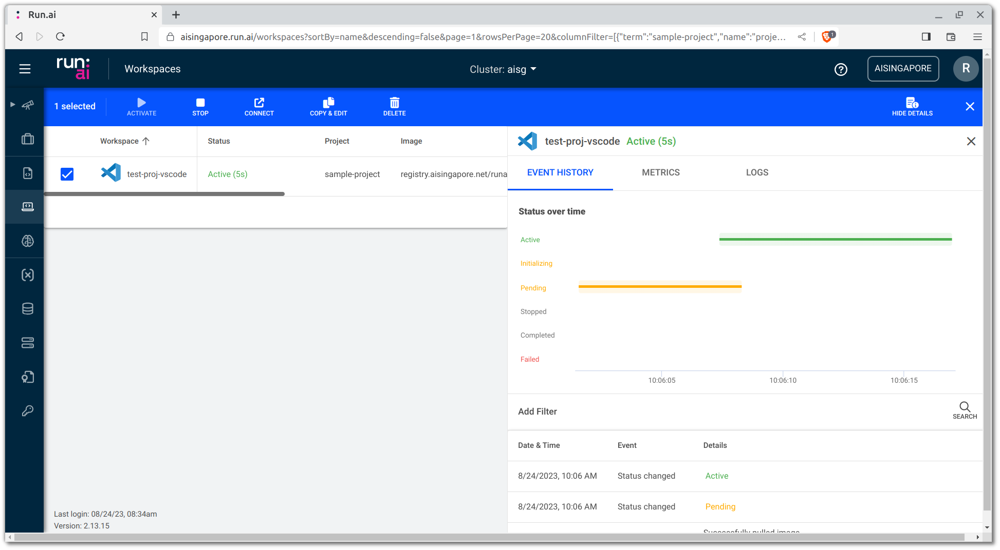
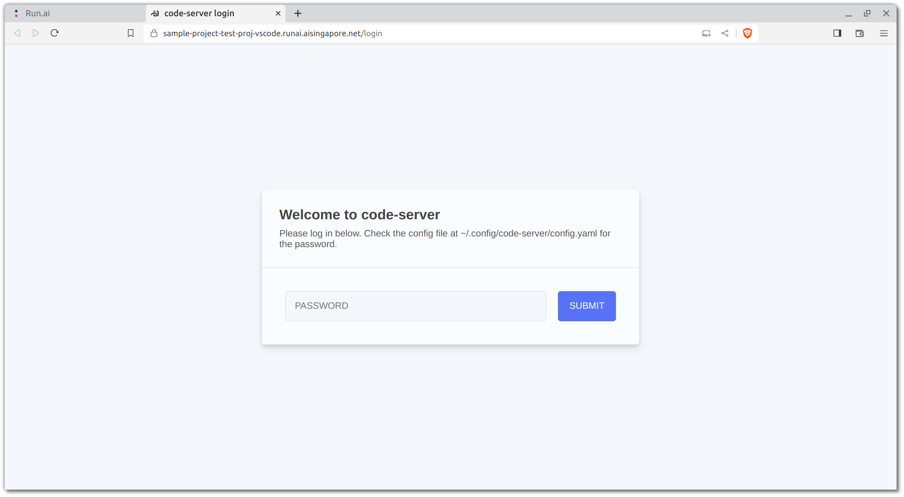
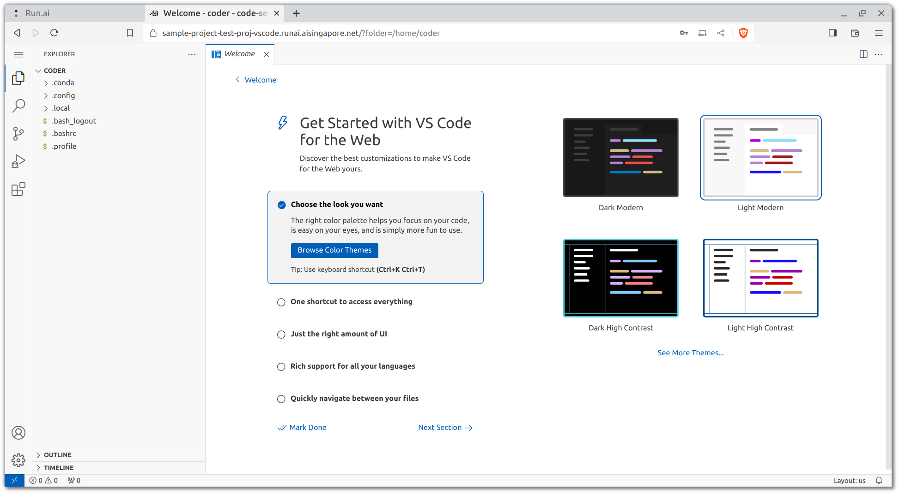
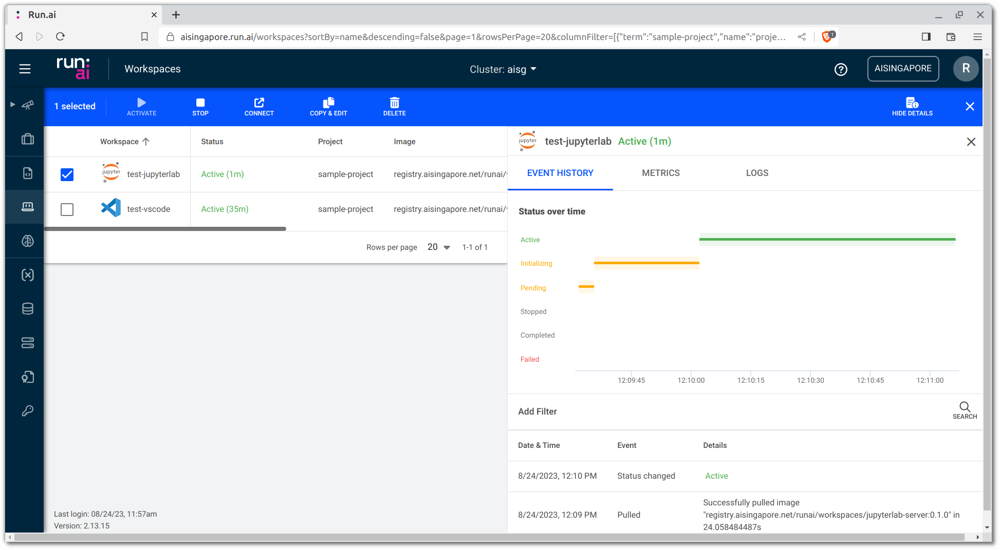
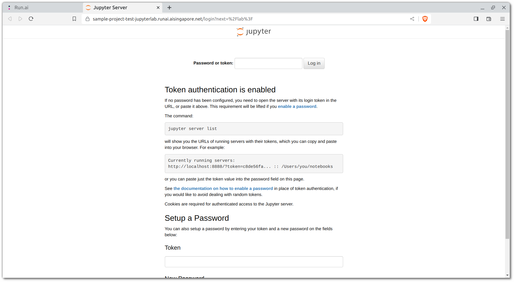
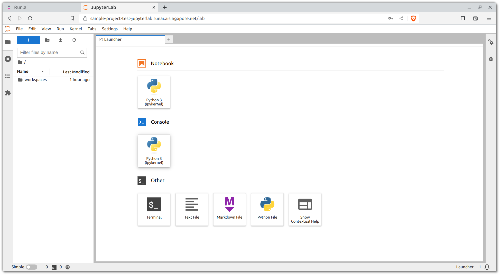

# Development Workspace

An advantage presented by orchestration platforms is that you can
utilise the Kubernetes cluster's resources for your development and
engineering works instead of your own resources.

We can make use of
[Run:ai workspaces](https://docs.run.ai/v2.13/Researcher/user-interface/workspaces/overview/)
to spin up VSCode or JupyterLab servers with which cluster resources
can be dedicated.

While there exist the option for engineers to set up either a VSCode
or JupyterLab service (or both), the former would suffice. Reason
being VSCode is an excellent code editor with integrated terminal
capabilities and it can also work with Jupyter notebooks.
JupyterLab on the other hand, while being the best interface for
Jupyter notebooks, has subpar UX for its terminal and code editor.
That is to be expected however as it is dedicated to the
Jupyter ecosystem.

## Workspace Building Blocks

Run:ai workspaces relies on an abstration layer of building blocks.
These building blocks allows for reusable setups where separate
configuration can be mixed and match to provide end-users with their
ideal setup.

Every workspace intance are built using the following building blocks:

- [environment](https://docs.run.ai/v2.13/Researcher/user-interface/workspaces/blocks/environments)
- [data source](https://docs.run.ai/v2.13/Researcher/user-interface/workspaces/blocks/datasources)
- [compute resource](https://docs.run.ai/v2.13/Researcher/user-interface/workspaces/blocks/compute)

On top of using and reusing building blocks that have existed prior,
you may create your own which in turn can be used by other users.

Do refer to Run:ai's documentation on more information for each of
these building blocks.

## VSCode

### Prebuilt VSCode Server

Every end-user of Run:ai would be able to quickly spin up a VSCode
server workspace using prebuilt blocks. While the
[steps for creating a workspace](https://docs.run.ai/v2.13/Researcher/user-interface/workspaces/create/workspace)
are detailed on Run:ai's documentation, listed below are the
recommended environment, compute resource, and data source that you
may make use of to spin up your first VSCode workspace, in the context
of AI Singapore's infrastructure.

- __Workspace name:__ `<YOUR_HYPHENATED_NAME>-vscode`

- __Environment:__ `aisg-vscode-server-v4-16-1`

- __Compute Resource:__ `cpu-mid`

- __Data Source:__ The persistent volume claim (PVC) that is dedicated
  to your project. For a project named `sample-project`, you may make use of
  `sample-project-pvc`.

Once you have selected the blocks, you can proceed to create the
workspace and you will be redirected to the workspaces page. On this
page, you may view the status of the workspace that you have just
created.



Once the workspace is active (indicated by a green status), you may
access the workspace by clicking on the `CONNECT` button and choosing
`VSCode`. This will open up a new browser tab for the VSCode server,
accessible through a URL that follows the following convention:
`<NAME_OF_PROJECT>-<NAME_OF_WORKSPACE>.runai.aisingapore.net`.
However, you cannot access the VSCode interface just yet; you will
prompted for a password.



To retrieve the password, head over to your terminal and run the
following command:

=== "Linux/macOS"

    ```bash
    $ runai exec <YOUR_HYPHENATED_NAME>-vscode -p {{cookiecutter.runai_proj_name}} -- cat /home/coder/.config/code-server/config.yaml
    bind-addr: 127.0.0.1:8080
    auth: password
    password: xxxxxxxxxxxxxxxxxxxxxxxx
    cert: false
    ```

=== "Windows PowerShell"

    ```powershell
    $ runai exec <YOUR_HYPHENATED_NAME>-vscode -p {{cookiecutter.runai_proj_name}} -- cat /home/coder/.config/code-server/config.yaml
    bind-addr: 127.0.0.1:8080
    auth: password
    password: xxxxxxxxxxxxxxxxxxxxxxxx
    cert: false
    ```

Copy the value for the `password` field into the prompt on the browser
and you should be directed to the VSCode server welcome tab.



However, the default folder that your VSCode server is accessing is the
home directory of the container's user, which is `/home/coder`.
__Since a container's filesystem is ephemeral, we have to make use of a
persistent storage__. Otherwise, any changes written within the
container's filesystem will be lost once the container is terminated.
For persistence, we look into using a persistent volume claim, which if
you have followed the recommendations above, a PVC would have been
mounted to the container.

__Reference(s):__

- [Kubernetes Docs - Persistent Volumes](https://kubernetes.io/docs/concepts/storage/persistent-volumes)

### Persistent Workspaces

As mentioned, a PVC should be attached to the workspaces to persist
changes to the filesystems. If a PVC is attached, the usual path to
access it would be `/<NAME_OF_DATA_SOURCE>`. For example, if the name of
the data source is called `sample-project-pvc`, the path to the PVC that
has been mounted to the container would be `/sample-project-pvc`.

=== "VSCode Server Terminal"

    ```bash
    $ ls -la / | grep "pvc"
    ```

By default, the PVCs would contain a `workspaces` directory with which
you can create a subdirectory for yourself treat it as your own personal
workspace, where all your work and other relevant assets can be
persisted.

=== "VSCode Server Terminal"

    ```bash
    $ cd /{{cookiecutter.runai_proj_name}}_pvc/workspaces
    $ mkdir <YOUR_HYPHENATED_NAME>
    ```

### Git from VSCode

To clone or push to Git repositories within the VSCode integrated
terminal, it is recommended that you first disable VSCode's
Git authentication handler:

Git by default is installed in the VSCode server image. One thing to
take note is that as the persistent storage would be accessible by the
rest of your project team members, __you should only use the `HTTPS`
protocol to clone the repository__ as opposed to creating and using an
`SSH` key within the VSCode server.

Now, let's clone your repository from the remote:

=== "VSCode Server Terminal"

    ```bash
    $ cd /{{cookiecutter.runai_proj_name}}/workspaces/<YOUR_HYPHENATED_NAME>
    $ git clone <REMOTE_URL_HTTPS>
    $ cd {{cookiecutter.repo_name}}
    ```

### Extensions for VSCode

You can install a multitude of extensions for your VSCode service but
there are a couple that would be crucial for your workflow, especially
if you intend to use Jupyter notebooks within the VSCode environment.

- [`ms-python.python`](https://marketplace.visualstudio.com/items?itemName=ms-python.python):
  Official extension by Microsoft for rich support for many things
  Python.
- [`ms-toolsai.jupyter`](https://marketplace.visualstudio.com/items?itemName=ms-toolsai.jupyter):
  Official extension by Microsoft for Jupyter support.

!!! warning "Attention"
    Do head over [here](./05-virtual-env.md#jupyter-kernel-for-vscode)
    on how to enable the usage of virtual `conda` environments within
    VSCode.

### Customising VSCode Server

The prebuilt VSCode image was built using a Dockerfile which can be
found in this repository at
`docker/vscode-server/vscode-server.Dockerfile`.
The Dockerfile was customised by the MLOps team at AI Singapore to
include tools deemed relevant for machine learning development, in the
context of the organisation's tech stack and infrastructure.

Aside from the server itself, here are some of the tools that are
included in the image:

- Git
- Miniconda
- `kubectl`
- Helm
- AWS CLI

Often times, project teams would like to further customise the VSCode
server image to their liking. One can edit the Dockerfile and build the
custom image:

=== "Linux/macOS"

    ```bash
    $ docker build \
        -t {{cookiecutter.harbor_registry_project_path}}/vscode-server-custom:0.1.0 \
        -f docker/vscode-server/vscode-server.Dockerfile \
        --platform linux/amd64 .
    $ docker push {{cookiecutter.harbor_registry_project_path}}/vscode-server-custom:0.1.0
    ```

=== "Windows PowerShell"

    ```powershell
    $ docker build `
        -t {{cookiecutter.harbor_registry_project_path}}/vscode-server-custom:0.1.0 `
        -f docker/vscode-server/vscode-server.Dockerfile `
        --platform linux/amd64 .
    $ docker push {{cookiecutter.harbor_registry_project_path}}/vscode-server-custom:0.1.0
    ```

## JupyterLab

!!! attention
    Setting up of a JupyterLab server is optional and not needed
    as a VSCode server is sufficient as a developer workspace.
    Resources are limited so use only what you need.

### Prebuilt JupyterLab Server

While Jupyter Notebooks are viewable, editable and executable within
a VSCode environment, most are still more familiar with Jupyter's
interface for interacting with or editing notebooks. We can spin up
a JupyterLab using the following recommended blocks:

- __Workspace name:__ `<YOUR_HYPHENATED_NAME>-jupyterlab`

- __Environment:__ `aisg-jupyterlab-server-0-1-0`

- __Compute Resource:__ `cpu-mid`

- __Data Source:__ The PVC that is dedicated to your project. For a
  sample project, you may make use of `sample-project-pvc`.

!!! warning "Attention"
    Under the `Environment` block, there is an expandable section called
    `More settings`. Under this section, you can provide more arguments
    for a container that will be spun up for the workspace. For the
    JupyterLab interface to be able to access any PVC mounted to the
    container, you should include the following argument:
    `--NotebookApp.notebook_dir="/path/to/pvc"`.

Once you have selected the blocks, you can proceed to create the
workspace and you will be redirected to the workspaces page. On this
page, you may view the status of the workspace that you have just
created.



Once the workspace is active (indicated by a green status), you may
access the workspace by clicking on the `CONNECT` button and choosing
`Jupyter`. This will open up a new browser tab for the VSCode server,
accessible through a URL that follows the following convention:
`<NAME_OF_PROJECT>-<NAME_OF_WORKSPACE>.runai.aisingapore.net`.
However, you cannot access the JupyterLab interface just yet; you will
prompted for a token.



To retrieve the token, head over to your terminal and run the
following command:

=== "Linux/macOS"

    ```bash
    $ runai logs <YOUR_HYPHENATED_NAME>-jupyterlab -p  {{cookiecutter.runai_proj_name}} | grep "lab?token"
    [I YYYY-MM-DD hh:mm:ss ServerApp] http://<NAME_OF_WORKSPACE>-X-X:8888/lab?token=XXXXXXXXXXXXXXXXXXXXXXXXXXXXXXXXXXXXXXXXXXXXXXXX
    [I YYYY-MM-DD hh:mm:ss ServerApp]     http://127.0.0.1:8888/lab?token=XXXXXXXXXXXXXXXXXXXXXXXXXXXXXXXXXXXXXXXXXXXXXXXX
            http://<NAME_OF_WORKSPACE>-X-X:8888/lab?token=XXXXXXXXXXXXXXXXXXXXXXXXXXXXXXXXXXXXXXXXXXXXXXXX
            http://127.0.0.1:8888/lab?token=XXXXXXXXXXXXXXXXXXXXXXXXXXXXXXXXXXXXXXXXXXXXXXXX
    ```

=== "Windows PowerShell"

    ```powershell
    $ runai logs <YOUR_HYPHENATED_NAME>-jupyterlab -p  {{cookiecutter.runai_proj_name}} | Where-Object{$_ -match "lab?token"}
    [I YYYY-MM-DD hh:mm:ss ServerApp] http://<NAME_OF_WORKSPACE>-X-X:8888/lab?token=XXXXXXXXXXXXXXXXXXXXXXXXXXXXXXXXXXXXXXXXXXXXXXXX
    [I YYYY-MM-DD hh:mm:ss ServerApp]     http://127.0.0.1:8888/lab?token=XXXXXXXXXXXXXXXXXXXXXXXXXXXXXXXXXXXXXXXXXXXXXXXX
            http://<NAME_OF_WORKSPACE>-X-X:8888/lab?token=XXXXXXXXXXXXXXXXXXXXXXXXXXXXXXXXXXXXXXXXXXXXXXXX
            http://127.0.0.1:8888/lab?token=XXXXXXXXXXXXXXXXXXXXXXXXXXXXXXXXXXXXXXXXXXXXXXXX
    ```

Copy the token value into the prompt on the browser and you should be
directed to a view like such:



__Reference(s):__

- [Jupyter Server Docs - Config file and command line options](https://jupyter-server.readthedocs.io/en/stable/other/full-config.html#other-full-config)

!!! Info
    Do head over
    [here](./05-virtual-env.md#jupyter-kernel-for-jupyterlab)
    on how to enable the usage of virtual `conda` environments within
    JupyterLab.

### Customising JupyterLab Server

Of course, like with the VSCode server, one can work on a customised
JupyterLab server image. The Dockerfile for the prebuilt JupyterLab
server as well as any associated files can be found under
`docker/jupyterlab-server`:

=== "Linux/macOS"

    ```bash
    $ docker build \
        -t {{cookiecutter.harbor_registry_project_path}}/jupyterlab-server-custom:0.1.0 \
        -f docker/jupyterlab-server/jupyterlab-server.Dockerfile \
        --platform linux/amd64 .
    $ docker push {{cookiecutter.harbor_registry_project_path}}/jupyterlab-server-custom:0.1.0
    ```

=== "Windows PowerShell"

    ```powershell
    $ docker build `
        -t {{cookiecutter.harbor_registry_project_path}}/jupyterlab-server-custom:0.1.0 `
        -f docker/jupyterlab-server/jupyterlab-server.Dockerfile `
        --platform linux/amd64 .
    $ docker push {{cookiecutter.harbor_registry_project_path}}/jupyterlab-server-custom:0.1.0
    ```

## Using Docker within Kubernetes

!!! caution
    Since these development environments are essentially pods
    deployed within a Kubernetes cluster, using Docker within the pods
    themselves is not feasible by default and while possible,
    should be avoided.

__Reference(s):__

- [Using Docker-in-Docker for your CI or testing environment? Think twice. - jpetazzo](https://jpetazzo.github.io/2015/09/03/do-not-use-docker-in-docker-for-ci/)
