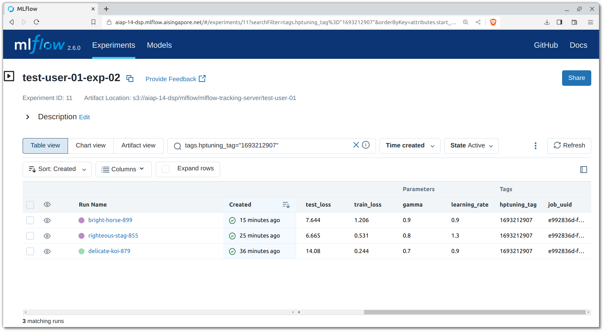

# Job Orchestration

Even though we can set up development workspaces to execute jobs and
workflows, these environments often have limited access to resources.
To carry out heavier workloads, we encourage the usage of job
orchestration features that Run:ai offers.

Jobs are submitted to the Kubernetes cluster through Run:ai and executed
within Docker containers. Using the images specified upon job
submission, Kubernetes pods are spun up to execute the entry points or
commands defined, tapping on to the cluster's available resources.

Any jobs that are submitted to Run:ai can be tracked and monitored
through Run:ai's dashboard.

## Pipeline Configuration

In this template, Hydra is the configuration framework of choice for the
data preparation and model training pipelines (or any pipelines that
doesn't belong to the model serving aspects).

The configurations for logging, pipelines and hyperparameter tuning can
be found under the `conf` folder. These YAML files are then referred to 
by Hydra or general utility functions
(`src/{{cookiecutter.src_package_name}}/general_utils.py`)
for loading of parameters and configurations. The defined default 
values can be overridden through the CLI.

!!! attention
    It is recommended that you have a basic understanding of
    [Hydra]'s concepts before you move on.

??? info "Reference Link(s)"

    - [Hydra Docs - Basic Override Syntax](https://hydra.cc/docs/advanced/override_grammar/basic/)

[Hydra]: https://hydra.cc/

## Data Preparation & Preprocessing

### Local

To process the sample raw data, there are many ways to do so. One way
is to run it locally. Ensure that you have activated your Conda 
environment before running the script. More information on this can be
found [here][venv]. You can also update your configuration variables at
`conf/process_data.yaml`, specifically this section:

```yaml
raw_data_dir_path: "./data/raw"
processed_data_dir_path: "./data/processed"
```

After that, run the script:

=== "Linux/macOS"

    ```bash
    # Add no_cuda=False at the end to enable GPU use.
    # Make sure you have installed CUDA/RoCM before using.
    # Check that LD_LIBRARY_PATH has been set.
    # Also set HIP_VISIBLE_DEVICES=0 if RoCM is used.
    python src/process_data.py
    ```

=== "Windows PowerShell"

    ```powershell
    python src\process_data.py
    ```

### Docker

We can also run through a Docker container. This requires the Docker 
image to be built from a Dockerfile 
(`docker/{{cookiecutter.src_package_name}}-cpu.Dockerfile`)
provided in this template:

=== "Linux/macOS"

    ```bash
    docker build \
        -t {{cookiecutter.registry_project_path}}/data-prep:0.1.0 \
        -f docker/{{cookiecutter.repo_name}}-cpu.Dockerfile \
        --platform linux/amd64 .
    ```

=== "Windows PowerShell"

    ```powershell
    docker build `
        -t {{cookiecutter.registry_project_path}}/data-prep:0.1.0 `
        -f docker/{{cookiecutter.repo_name}}-cpu.Dockerfile `
        --platform linux/amd64 .
    ```

=== "VSCode Server Terminal"

    ```bash
    # Run `runai login` and `runai config project {{cookiecutter.proj_name}}` first if needed
    # Run this in the base of your project repository, and change accordingly
    khull kaniko --context $(pwd) \
        --dockerfile $(pwd)/docker/{{cookiecutter.repo_name}}-cpu.Dockerfile \
        --destination {{cookiecutter.registry_project_path}}/data-prep:0.1.0 \

        --gcp \

        --cred-file /path/to/docker/config.json \
        -v <pvc-name>:/path/to/pvc/mount
    ```

=== "Run:ai YAML"

    ```bash
    # Change the values within the file if any before running this
    kubectl apply -f aisg-context/runai/04-docker-build-dataprep.yml
    ```

After building the image, you can run the script through Docker:

=== "Linux/macOS"

    ```bash
    sudo chown 2222:2222 ./data
    docker run --rm \
        -v ./data:/home/aisg/{{cookiecutter.repo_name}}/data \
        -w /home/aisg/{{cookiecutter.repo_name}} \
        {{cookiecutter.registry_project_path}}/data-prep:0.1.0 \
        bash -c "source activate {{cookiecutter.repo_name}} && python src/process_data.py"
    ```

=== "Windows PowerShell"

    ```powershell
    docker run --rm `
        -v .\data:/home/aisg/{{cookiecutter.repo_name}}/data `
        -w /home/aisg/{{cookiecutter.repo_name}} `
        {{cookiecutter.registry_project_path}}/data-prep:0.1.0 `
        bash -c "source activate {{cookiecutter.repo_name}} && python src/process_data.py"
    ```

Once you are satisfied with the Docker image, you can push it to the 
Docker registry:

!!! warning "Attention"

    If you're following the "VSCode Server Terminal" or "Run:ai YAML"
    method, you can skip this as you have already pushed to the Docker
    registry.

=== "Linux/macOS"

    ```bash
    docker push {{cookiecutter.registry_project_path}}/data-prep:0.1.0
    ```
    
=== "Windows PowerShell"

    ```powershell
    docker push {{cookiecutter.registry_project_path}}/data-prep:0.1.0
    ```

### Run:ai

Now that we have the Docker image pushed to the registry, we can submit
a job using that image to Run:ai\:

=== "Linux/macOS"

    ```bash
    # Switch working-dir to /<NAME_OF_DATA_SOURCE>/workspaces/<YOUR_HYPHENATED_NAME>/{{cookiecutter.repo_name}} to use the repo in the PVC
    runai submit \
        --job-name-prefix <YOUR_HYPHENATED_NAME>-data-prep \
        -i {{cookiecutter.registry_project_path}}/data-prep:0.1.0 \
        --working-dir /home/aisg/{{cookiecutter.repo_name}} \
        --pvc <NAME_OF_DATA_SOURCE>:/<NAME_OF_DATA_SOURCE> \
        --cpu 2 \
        --memory 4G \
        --command -- '/bin/bash -c "source activate {{cookiecutter.repo_name}} && python src/process_data.py raw_data_dir_path=/<NAME_OF_DATA_SOURCE>/workspaces/<YOUR_HYPHENATED_NAME>/data/raw processed_data_dir_path=/<NAME_OF_DATA_SOURCE>/workspaces/<YOUR_HYPHENATED_NAME>/data/processed"'
    ```

=== "Windows PowerShell"

    ```powershell
    # Switch working-dir to /<NAME_OF_DATA_SOURCE>/workspaces/<YOUR_HYPHENATED_NAME>/{{cookiecutter.repo_name}} to use the repo in the PVC
    runai submit `
        --job-name-prefix <YOUR_HYPHENATED_NAME>-data-prep `
        -i {{cookiecutter.registry_project_path}}/data-prep:0.1.0 `
        --working-dir /home/aisg/{{cookiecutter.repo_name}} `
        --pvc <NAME_OF_DATA_SOURCE>:/<NAME_OF_DATA_SOURCE> `
        --cpu 2 `
        --memory 4G `
        --command -- "/bin/bash -c 'source activate {{cookiecutter.repo_name}} && python src/process_data.py raw_data_dir_path=/<NAME_OF_DATA_SOURCE>/workspaces/<YOUR_HYPHENATED_NAME>/data/raw processed_data_dir_path=/<NAME_OF_DATA_SOURCE>/workspaces/<YOUR_HYPHENATED_NAME>/data/processed'"
    ```

=== "VSCode Server Terminal"

    ```bash
    # Switch working-dir to /<NAME_OF_DATA_SOURCE>/workspaces/<YOUR_HYPHENATED_NAME>/{{cookiecutter.repo_name}} to use the repo in the PVC
    runai submit \
        --job-name-prefix <YOUR_HYPHENATED_NAME>-data-prep \
        -i {{cookiecutter.registry_project_path}}/data-prep:0.1.0 \
        --working-dir /home/aisg/{{cookiecutter.repo_name}} \
        --pvc <NAME_OF_DATA_SOURCE>:/<NAME_OF_DATA_SOURCE> \
        --cpu 2 \
        --memory 4G \
        --command -- '/bin/bash -c "source activate {{cookiecutter.repo_name}} && python src/process_data.py raw_data_dir_path=/<NAME_OF_DATA_SOURCE>/workspaces/<YOUR_HYPHENATED_NAME>/data/raw processed_data_dir_path=/<NAME_OF_DATA_SOURCE>/workspaces/<YOUR_HYPHENATED_NAME>/data/processed"'
    ```

=== "Run:ai YAML"

    ```bash
    # Change the values within the file if any before running this
    kubectl apply -f aisg-context/runai/05-dataprep.yml
    ```

After some time, the data processing job should conclude and we can
proceed with training the predictive model.
The processed data is exported to the directory
`/<NAME_OF_DATA_SOURCE>/workspaces/<YOUR_HYPHENATED_NAME>/data/processed`.
We will be passing this path to the model training workflows.

[venv]: ./05-virtual-env.md#local-virtual-environments

## Model Training

Now that we have processed the raw data, we can look into training the
sentiment classification model. The script relevant for this section
is `src/train_model.py`. In this script, you can see it using some
utility functions from
`src/{{cookiecutter.src_package_name}}/general_utils.py`
as well, most notably the functions for utilising MLflow utilities for
tracking experiments. Let's set up the tooling for experiment tracking
before we start model experimentation.

### Experiment Tracking


    

    


In the module `src/{{cookiecutter.src_package_name}}/general_utils.py`,
the functions `mlflow_init` and `mlflow_log` are used to initialise
MLflow experiments as well as log information and artifacts relevant
for a run to a remote MLflow Tracking server. An MLflow Tracking server 
is usually set up within the Run:ai project's namespace for projects 
that requires model experimentation. Artifacts logged through the 
MLflow API can be uploaded to {{objstg}} buckets, assuming the client 
is authorised for access to {{objstg}}.

To log and upload artifacts to {{objstg}} buckets through MLFlow, you 
need to ensure that the client has access to the credentials of an 
account that can write to a bucket. This is usually settled by the 
MLOps team, so you need only interact with MLFlow to download the 
artifacts without explicitly knowing the {{objstg}} credentials.

??? info "Reference Link(s)"

    - [MLflow Docs - Tracking](https://www.mlflow.org/docs/latest/tracking.html#)
    - [MLflow Docs - Tracking (Artifact Stores)](https://www.mlflow.org/docs/latest/tracking.html#artifact-stores)

### Local

The beauty of MLFlow is that it can run locally, within a Docker 
container or connecting to a remote MLFlow server. In this case, it is
assumed that you are spinning up an MLFlow instance locally whenever it
is needed.

To run the model training script locally, you should have your Conda 
environment activated from the data preparation stage, and update your
configuration variables at `conf/train_model.yaml`, especially this
section:

```yaml
setup_mlflow: true
mlflow_autolog: false
mlflow_tracking_uri: "./mlruns"
mlflow_exp_name: "{{cookiecutter.src_package_name_short}}"
data_dir_path: "./data/processed"
dummy_param1: 1.3
dummy_param2: 0.8
```

After that, run the script:

=== "Linux/macOS"

    ```bash
    python src/train_model.py
    ```

=== "Windows PowerShell"

    ```powershell
    python src\train_model.py
    ```

This will generate the MLFlow logs and artifacts locally, of which you 
can parse it with the MLFlow UI with:

```bash
conda activate mlflow-test
mlflow server
```

and connect to http://localhost:5000.

### Docker

We shall build the Docker image from the Docker file 
`docker/{{cookiecutter.repo_name}}-gpu.Dockerfile`:

=== "Linux/macOS"

    ```bash
    docker build \
        -t {{cookiecutter.registry_project_path}}/model-training:0.1.0 \
        -f docker/{{cookiecutter.repo_name}}-gpu.Dockerfile \
        --platform linux/amd64 .
    ```

=== "Windows PowerShell"

    ```powershell
    docker build `
        -t {{cookiecutter.registry_project_path}}/model-training:0.1.0 `
        -f docker/{{cookiecutter.repo_name}}-gpu.Dockerfile `
        --platform linux/amd64 .
    ```

=== "VSCode Server Terminal"

    ```bash
    # Run `runai login` and `runai config project {{cookiecutter.proj_name}}` first if needed
    # Run this in the base of your project repository, and change accordingly
    khull kaniko --context $(pwd) \
        --dockerfile $(pwd)/docker/{{cookiecutter.repo_name}}-gpu.Dockerfile \
        --destination {{cookiecutter.registry_project_path}}/model-training:0.1.0 \

        --gcp \

        --cred-file /path/to/docker/config.json \
        -v <pvc-name>:/path/to/pvc/mount
    ```

=== "Run:ai YAML"

    ```bash
    # Change the values within the file if any before running this
    kubectl apply -f aisg-context/runai/06-docker-build-modeltraining.yml
    ```

After building the image, you can run the script through Docker:

=== "Linux/macOS"

    ```bash
    sudo chown 2222:2222 ./mlruns ./models
    # Add --gpus=all for Nvidia GPUs in front of the image name
    # Add --device=/dev/kfd --device=/dev/dri --group-add video for AMD GPUs in front of the image name
    # Add no_cuda=false to use GPUs behind the image name
    docker run --rm \
        -v ./data:/home/aisg/{{cookiecutter.repo_name}}/data \
        -v ./mlruns:/home/aisg/{{cookiecutter.repo_name}}/mlruns \
        -v ./models:/home/aisg/{{cookiecutter.repo_name}}/models \
        -w /home/aisg/{{cookiecutter.repo_name}} \
        {{cookiecutter.registry_project_path}}/model-training:0.1.0 \
        bash -c "source activate {{cookiecutter.repo_name}} && python src/train_model.py"
    ```

=== "Windows PowerShell"

    ```powershell
    docker run --rm \
        -v .\data:/home/aisg/{{cookiecutter.repo_name}}/data `
        -v .\mlruns:/home/aisg/{{cookiecutter.repo_name}}/mlruns `
        -v .\models:/home/aisg/{{cookiecutter.repo_name}}/models `
        -w /home/aisg/{{cookiecutter.repo_name}} `
        {{cookiecutter.registry_project_path}}/model-training:0.1.0 `
        bash -c "source activate {{cookiecutter.repo_name}} && python src/train_model.py"
    ```

You can run MLFlow in Docker as well with the following command:

=== "Linux/macOS"

    ```bash
    docker run --rm -d \
        -p 5000:5000
        -v ./mlruns:/mlruns \
        ghcr.io/mlflow/mlflow:v2.9.2 \
        mlflow server -h 0.0.0.0
    ```

=== "Windows PowerShell"

    ```powershell
    docker run --rm -d `
        -p 5000:5000 `
        -v .\mlruns:/mlruns `
        ghcr.io/mlflow/mlflow:v2.9.2 `
        mlflow server -h 0.0.0.0
    ```

and connect to http://localhost:5000.

Once you are satisfied with the Docker image, you can push it to the 
Docker registry:

!!! warning "Attention"

    If you're following the "VSCode Server Terminal" or "Run:ai YAML"
    method, you can skip this as you have already pushed to the Docker
    registry.

=== "Linux/macOS"

    ```bash
    docker push {{cookiecutter.registry_project_path}}/model-training:0.1.0
    ```
    
=== "Windows PowerShell"

    ```powershell
    docker push {{cookiecutter.registry_project_path}}/model-training:0.1.0
    ```

### Run:ai

Now that we have the Docker image pushed to the registry, we can run a 
job using it:

=== "Linux/macOS"

    ```bash
    # Switch working-dir to /<NAME_OF_DATA_SOURCE>/workspaces/<YOUR_HYPHENATED_NAME>/{{cookiecutter.repo_name}} to use the repo in the PVC
    runai submit \
        --job-name-prefix <YOUR_HYPHENATED_NAME>-train \
        -i {{cookiecutter.registry_project_path}}/model-training:0.1.0 \
        --working-dir /home/aisg/{{cookiecutter.repo_name}} \
        --pvc <NAME_OF_DATA_SOURCE>:/<NAME_OF_DATA_SOURCE> \
        --cpu 2 \
        --memory 4G \
        -e MLFLOW_TRACKING_USERNAME=<YOUR_MLFLOW_USERNAME> \
        -e MLFLOW_TRACKING_PASSWORD=<YOUR_MLFLOW_PASSWORD> \
        --command -- '/bin/bash -c "source activate {{cookiecutter.repo_name}} && python src/train_model.py data_dir_path=/<NAME_OF_DATA_SOURCE>/workspaces/<YOUR_HYPHENATED_NAME>/data/processed artifact_dir_path=/<NAME_OF_DATA_SOURCE>/workspaces/<YOUR_HYPHENATED_NAME>/models mlflow_tracking_uri=<MLFLOW_TRACKING_URI>"'
    ```

=== "Windows PowerShell"

    ```powershell
    # Switch working-dir to /<NAME_OF_DATA_SOURCE>/workspaces/<YOUR_HYPHENATED_NAME>/{{cookiecutter.repo_name}} to use the repo in the PVC
    runai submit `
        --job-name-prefix <YOUR_HYPHENATED_NAME>-train `
        -i {{cookiecutter.registry_project_path}}/model-training:0.1.0 `
        --working-dir /home/aisg/{{cookiecutter.repo_name}} `
        --pvc <NAME_OF_DATA_SOURCE>:/<NAME_OF_DATA_SOURCE> `
        --cpu 2 `
        --memory 4G `
        -e MLFLOW_TRACKING_USERNAME=<YOUR_MLFLOW_USERNAME> `
        -e MLFLOW_TRACKING_PASSWORD=<YOUR_MLFLOW_PASSWORD> `
        --command -- "/bin/bash -c 'source activate {{cookiecutter.repo_name}} && python src/train_model.py data_dir_path=/<NAME_OF_DATA_SOURCE>/workspaces/<YOUR_HYPHENATED_NAME>/data/processed artifact_dir_path=/<NAME_OF_DATA_SOURCE>/workspaces/<YOUR_HYPHENATED_NAME>/models mlflow_tracking_uri=<MLFLOW_TRACKING_URI>'"
    ```

=== "VSCode Server Terminal"

    ```bash
    # Switch working-dir to /<NAME_OF_DATA_SOURCE>/workspaces/<YOUR_HYPHENATED_NAME>/{{cookiecutter.repo_name}} to use the repo in the PVC
    $ runai submit \
        --job-name-prefix <YOUR_HYPHENATED_NAME>-train \
        -i {{cookiecutter.registry_project_path}}/model-training:0.1.0 \
        --working-dir /home/aisg/{{cookiecutter.repo_name}} \
        --pvc <NAME_OF_DATA_SOURCE>:/<NAME_OF_DATA_SOURCE> \
        --cpu 2 \
        --memory 4G \
        -e MLFLOW_TRACKING_USERNAME=<YOUR_MLFLOW_USERNAME> \
        -e MLFLOW_TRACKING_PASSWORD=<YOUR_MLFLOW_PASSWORD> \
        --command -- '/bin/bash -c "source activate {{cookiecutter.repo_name}} && python src/train_model.py data_dir_path=/<NAME_OF_DATA_SOURCE>/workspaces/<YOUR_HYPHENATED_NAME>/data/processed artifact_dir_path=/<NAME_OF_DATA_SOURCE>/workspaces/<YOUR_HYPHENATED_NAME>/models mlflow_tracking_uri=<MLFLOW_TRACKING_URI>"'
    ```

=== "Run:ai YAML"

    ```bash
    # Change the values within the file if any before running this
    kubectl apply -f aisg-context/runai/07-modeltraining.yml
    ```

Once you have successfully run an experiment, you may inspect the run
on the MLflow Tracking server. Through the MLflow Tracking server
interface, you can view the metrics and parameters logged for the run,
as well as download the artifacts that have been uploaded to the ECS
bucket. You can also compare runs with each other.


!!! tip
    Every job submitted with `runai submit` is assigned a unique ID,
    and a unique job name if the `--job-name-prefix` is used. The
    `mlflow_init` function within the `general_utils.py` module tags
    every experiment name with the job's name and UUID as provided by
    Run:ai, with the tags `job_uuid` and `job_name`. This allows you to
    easily identify the MLflow experiment runs that are associated with 
    each Run:ai job. You can filter for MLflow experiment runs 
    associated with a specific Run:ai job by using MLflow's search 
    filter expressions and API.

    ??? info "Reference Link(s)"

        - [Run:ai Docs - Environment Variables inside a Run:ai Workload](https://docs.run.ai/v2.9/Researcher/best-practices/env-variables/)
        - [MLflow Docs - Search Runs](https://mlflow.org/docs/latest/search-runs.html)

!!! info
    If your project has GPU quotas assigned to it, you can make use of
    it by specifying the `--gpu` flag in the `runai submit` command. As
    part of Run:ai's unique selling point, you can also specify
    fractional values, which would allow you to utilise a fraction of a
    GPU. This is useful for projects that require a GPU for training,
    but do not require the full capacity of a GPU.

### Hyperparameter Tuning

For many ML problems, we would be bothered with finding the optimal
parameters to train our models with. While we are able to override the
parameters for our model training workflows, imagine having to sweep
through a distribution of values. For example, if you were to seek for
the optimal learning rate within a log space, we would have to execute
`runai submit` a myriad of times manually, just to provide the training
script with a different learning rate value each time. It is reasonable
that one seeks for ways to automate this workflow.

[Optuna][optuna] is an optimisation framework designed for ML 
use-cases. Its features includes:

- ease of modularity,
- optimisation algorithms for searching the best set of parameters,
- and [parallelisation][parallel] capabilities for faster sweeps.

In addition, Hydra has a plugin for utilising Optuna which further
translates to ease of configuration. To use Hydra's plugin for Optuna,
we have to provide further overrides within the YAML config, and this is
observed in `conf/train_model.yaml`:

```yaml
defaults:
  - override hydra/sweeper: optuna
  - override hydra/sweeper/sampler: tpe

hydra:
  sweeper:
    sampler:
      seed: 55
    direction: ["minimize", "maximize"]
    study_name: "image-classification"
    storage: null
    n_trials: 3
    n_jobs: 1
    params:
      dummy_param1: range(0.9,1.7,step=0.1)
      dummy_param2: choice(0.7,0.8,0.9)
```

These fields are used by the Optuna Sweeper plugin to configure the
Optuna study.

!!! attention
    The fields defined are terminologies used by Optuna. Therefore, it is
    recommended that you understand the basics of the tool.
    [This overview video][optuna-vid] covers well on the concepts 
    brought upon by Optuna.

    Here are the definitions for some of the fields:

    - `params` is used to specify the parameters to be tuned, and the 
      values to be searched through
    - `n_trials` specifies the number of trials to be executed
    - `n_jobs` specifies the number of trials to be executed in 
      parallel

As to how the training script would work towards training a model with
the best set of parameters, there are two important lines from two
different files that we have to pay attention to.

`src/train_model.py`
```python
...
    return args["dummy_param1"], args["dummy_param2"]
...
```

`conf/train_model.yaml`
```yaml
...
    direction: ["minimize", "maximize"]
...
```

In the training script the returned variables are to contain values
that we seek to optimise for. In this case, we seek to minimise the 
loss and maximise the accuracy. The `hydra.sweeper.direction` field in 
the YAML config is used to specify the direction that those variables 
are to optimise towards, defined in a positional manner within a list.

An additional thing to take note of is that for each trial where a
different set of parameters are concerned, a new MLflow run has to be
initialised. However, we need to somehow link all these different runs
together so that we can compare all the runs within a single Optuna
study (set of trials). How we do this is that we provide each trial 
with the same tag to be logged to MLflow (`hptuning_tag`) which would
essentially be the date epoch value of the moment you submitted the job
to Run:ai. This tag is defined using the environment value
`MLFLOW_HPTUNING_TAG`. This tag is especially useful if you are
executing the model training job out of the Run:ai platform, as the
`JOB_NAME` and `JOB_UUID` environment variables would not be available
by default.

#### Local 

=== "Linux/macOS"

    ```bash
    python src/train_model.py
    ```

=== "Windows PowerShell"

    ```powershell
    python src\train_model.py --multirun
    ```

#### Docker

=== "Linux/macOS"

    ```bash
    docker run --rm \
        -v ./data:/home/aisg/{{cookiecutter.repo_name}}/data \
        -v ./mlruns:/home/aisg/{{cookiecutter.repo_name}}/mlruns \
        -v ./models:/home/aisg/{{cookiecutter.repo_name}}/models \
        -w /home/aisg/{{cookiecutter.repo_name}} \
        {{cookiecutter.registry_project_path}}/model-training:0.1.0 \
        python src/train_model.py --multirun
    ```

=== "Windows PowerShell"

    ```powershell
    docker run --rm \
        -v .\data:/home/aisg/{{cookiecutter.repo_name}}/data `
        -v .\mlruns:/home/aisg/{{cookiecutter.repo_name}}/mlruns `
        -v .\models:/home/aisg/{{cookiecutter.repo_name}}/models `
        -w /home/aisg/{{cookiecutter.repo_name}} `
        {{cookiecutter.registry_project_path}}/model-training:0.1.0 `
        python src/train_model.py
    ```
    
#### Run:ai

=== "Linux/macOS"

    ```bash
    # Switch working-dir to /<NAME_OF_DATA_SOURCE>/workspaces/<YOUR_HYPHENATED_NAME>/{{cookiecutter.repo_name}} to use the repo in the PVC
    runai submit \
        --job-name-prefix <YOUR_HYPHENATED_NAME>-train \
        -i {{cookiecutter.registry_project_path}}/model-training:0.1.0 \
        --working-dir /home/aisg/{{cookiecutter.repo_name}} \
        --pvc <NAME_OF_DATA_SOURCE>:/<NAME_OF_DATA_SOURCE> \
        --cpu 2 \
        --memory 4G \
        -e MLFLOW_TRACKING_USERNAME=<YOUR_MLFLOW_USERNAME> \
        -e MLFLOW_TRACKING_PASSWORD=<YOUR_MLFLOW_PASSWORD> \
        -e MLFLOW_HPTUNING_TAG=$(date +%s) \
        --command -- "/bin/bash -c 'source activate {{cookiecutter.repo_name}} && python src/train_model.py --multirun data_dir_path=/<NAME_OF_DATA_SOURCE>/workspaces/<YOUR_HYPHENATED_NAME>/data/processed artifact_dir_path=/<NAME_OF_DATA_SOURCE>/workspaces/<YOUR_HYPHENATED_NAME>/models mlflow_tracking_uri=<MLFLOW_TRACKING_URI>'"
    ```

=== "Windows PowerShell"

    ```powershell
    # Switch working-dir to /<NAME_OF_DATA_SOURCE>/workspaces/<YOUR_HYPHENATED_NAME>/{{cookiecutter.repo_name}} to use the repo in the PVC
    runai submit `
        --job-name-prefix <YOUR_HYPHENATED_NAME>-train `
        -i {{cookiecutter.registry_project_path}}/model-training:0.1.0 `
        --working-dir /home/aisg/{{cookiecutter.repo_name}} `
        --pvc <NAME_OF_DATA_SOURCE>:/<NAME_OF_DATA_SOURCE> `
        --cpu 2 `
        --memory 4G `
        -e MLFLOW_TRACKING_USERNAME=<YOUR_MLFLOW_USERNAME> `
        -e MLFLOW_TRACKING_PASSWORD=<YOUR_MLFLOW_PASSWORD> `
        -e MLFLOW_HPTUNING_TAG=$(Get-Date -UFormat %s -Millisecond 0) `
        --command -- "/bin/bash -c 'source activate {{cookiecutter.repo_name}} && python src/train_model.py --multirun data_dir_path=/<NAME_OF_DATA_SOURCE>/workspaces/<YOUR_HYPHENATED_NAME>/data/processed artifact_dir_path=/<NAME_OF_DATA_SOURCE>/workspaces/<YOUR_HYPHENATED_NAME>/models mlflow_tracking_uri=<MLFLOW_TRACKING_URI>'"
    ```

=== "VSCode Server Terminal"

    ```bash
    # Switch working-dir to /<NAME_OF_DATA_SOURCE>/workspaces/<YOUR_HYPHENATED_NAME>/{{cookiecutter.repo_name}} to use the repo in the PVC
    runai submit \
        --job-name-prefix <YOUR_HYPHENATED_NAME>-train \
        -i {{cookiecutter.registry_project_path}}/model-training:0.1.0 \
        --working-dir /home/aisg/{{cookiecutter.repo_name}} \
        --pvc <NAME_OF_DATA_SOURCE>:/<NAME_OF_DATA_SOURCE> \
        --cpu 2 \
        --memory 4G \
        -e MLFLOW_TRACKING_USERNAME=<YOUR_MLFLOW_USERNAME> \
        -e MLFLOW_TRACKING_PASSWORD=<YOUR_MLFLOW_PASSWORD> \
        -e MLFLOW_HPTUNING_TAG=$(date +%s) \
        --command -- "/bin/bash -c 'source activate {{cookiecutter.repo_name}} && python src/train_model.py --multirun data_dir_path=/<NAME_OF_DATA_SOURCE>/workspaces/<YOUR_HYPHENATED_NAME>/data/processed artifact_dir_path=/<NAME_OF_DATA_SOURCE>/workspaces/<YOUR_HYPHENATED_NAME>/models mlflow_tracking_uri=<MLFLOW_TRACKING_URI>'"
    ```

=== "Run:ai YAML"

    ```bash
    # Change the values within the file if any before running this
    kubectl apply -f aisg-context/runai/08-modeltraining-hp.yml
    ```



??? info "Reference Link(s)"

    - [Run:ai Docs - Environment Variables inside a Run:ai Workload](https://docs.run.ai/v2.9/Researcher/best-practices/env-variables/)
    - [Hydra Docs - Optuna Sweeper Plugin](https://hydra.cc/docs/plugins/optuna_sweeper/)
    - [MLflow Docs - Search Syntax](https://www.mlflow.org/docs/latest/search-syntax.html)

[optuna]: https://optuna.readthedocs.io/en/stable/
[parallel]: https://optuna.readthedocs.io/en/stable/tutorial/10_key_features/004_distributed.html
[optuna-vid]: https://www.youtube.com/watch?v=P6NwZVl8ttc