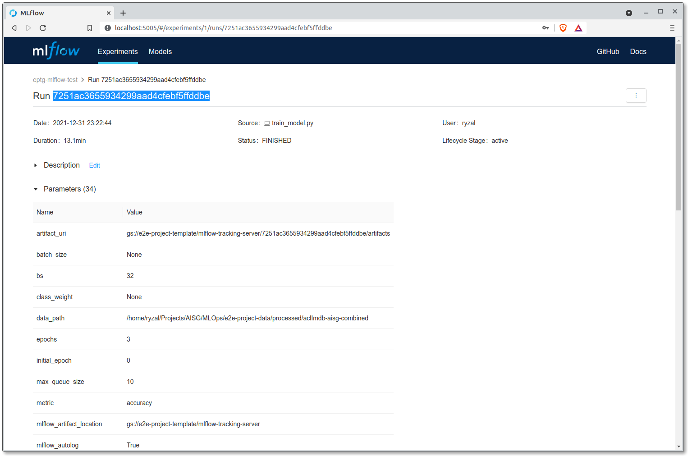
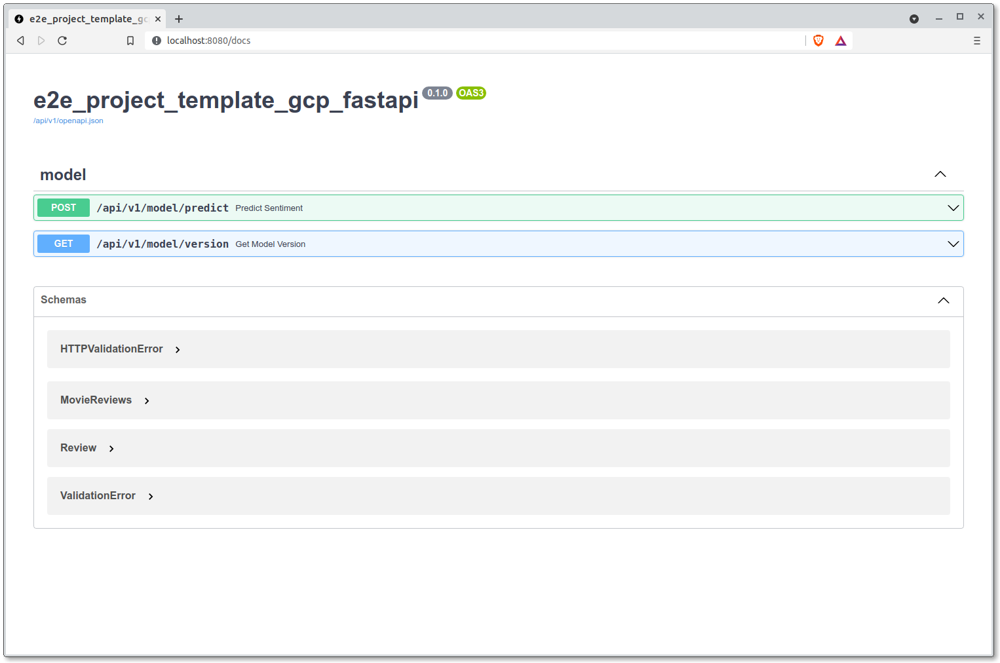

# Deployment

Assuming we have a predictive model that we are satisfied with, we can
serve it within a REST API service with which requests can be made to
and predictions are returned.

Python has plenty of web frameworks that we can leverage on to build
our REST API. Popular examples include
[Flask](https://flask.palletsprojects.com/en/2.0.x/),
[Django](https://www.djangoproject.com/) and
[Starlette](https://www.starlette.io/). For this guide however, we will
resort to the well-known [FastAPI](https://fastapi.tiangolo.com/)
(which is based on Starlette itself).

__Reference(s):__

- [IBM Technology - What is a REST API? (Video)](https://www.youtube.com/watch?v=lsMQRaeKNDk)

## Model Artifacts

Seen in
["Model Training"](./07-job-orchestration.md#model-training)
, we have the trained models
uploaded to ECS through the MLflow Tracking server (done through
autolog). With that, we have the following pointers to take note of:

- By default, each MLflow experiment run is given a unique ID.
- When artifacts are uploaded to ECS through MLflow,
  the artifacts are located within directories named after the
  unique IDs of the runs.
- Artifacts for specific runs will be uploaded to a directory with a
  convention similar to the following:
  `<MLFLOW_EXPERIMENT_ARTIFACT_LOCATION>/<MLFLOW_RUN_UUID>/artifacts`.
- With this path/URI, we can use the AWS CLI to download the predictive
  model from ECS into a mounted volume when we run the Docker image for
  the REST APIs.

Here's how you can quickly retrieve the artifact location of a
specific MLflow experiment within your VSCode server:

=== "Linux/macOS"

    ```bash
    $ export MLFLOW_TRACKING_URI=<MLFLOW_TRACKING_URI>
    $ export MLFLOW_TRACKING_USERNAME=<MLFLOW_TRACKING_USERNAME>
    $ export MLFLOW_TRACKING_PASSWORD=<MLFLOW_TRACKING_PASSWORD>
    $  python -c "import mlflow; mlflow_experiment = mlflow.get_experiment_by_name('<NAME_OF_DEFAULT_MLFLOW_EXPERIMENT>'); print(mlflow_experiment.artifact_location)"
    s3://<BUCKET_NAME>/subdir/paths
    ```

=== "Windows PowerShell"

    ```powershell
    $ $Env:MLFLOW_TRACKING_URI=<MLFLOW_TRACKING_URI>
    $ $Env:MLFLOW_TRACKING_USERNAME=<MLFLOW_TRACKING_USERNAME>
    $ $Env:MLFLOW_TRACKING_PASSWORD=<MLFLOW_TRACKING_PASSWORD>
    $  python -c "import mlflow; mlflow_experiment = mlflow.get_experiment_by_name('<NAME_OF_DEFAULT_MLFLOW_EXPERIMENT>'); print(mlflow_experiment.artifact_location)"
    s3://<BUCKET_NAME>/subdir/paths
    ```

To list the contents of the artifact location, you can use the AWS CLI
(installed within the VSCOde server by default) like so:

=== "Linux/macOS"

    ```bash
    $ export AWS_ACCESS_KEY_ID=<AWS_ACCESS_KEY_ID>
    $ export AWS_SECRET_ACCESS_KEY=<AWS_SECRET_ACCESS_KEY>
    $ aws s3 ls --endpoint-url "https://necs.nus.edu.sg" <MLFLOW_EXPERIMENT_ARTIFACT_LOCATION>/
                           PRE XXXXXXXXXXXXXXXXXXXXXXXXXXXXXXXX/
                           PRE YYYYYYYYYYYYYYYYYYYYYYYYYYYYYYYY/
                           PRE ZZZZZZZZZZZZZZZZZZZZZZZZZZZZZZZZ/
    ```

=== "Windows PowerShell"

    ```powershell
    $ $Env:AWS_ACCESS_KEY_ID=<AWS_ACCESS_KEY_ID>
    $ $Env:AWS_SECRET_ACCESS_KEY=<AWS_SECRET_ACCESS_KEY>
    $ aws s3 ls --endpoint-url "https://necs.nus.edu.sg" <MLFLOW_EXPERIMENT_ARTIFACT_LOCATION>/
                           PRE XXXXXXXXXXXXXXXXXXXXXXXXXXXXXXXX/
                           PRE YYYYYYYYYYYYYYYYYYYYYYYYYYYYYYYY/
                           PRE ZZZZZZZZZZZZZZZZZZZZZZZZZZZZZZZZ/
    ```

What would be listed are subdirectories named after MLflow experiment
unique IDs. Within each of these subdirectories, we will find the
artifacts uploaded to ECS.To list the artifacts of a specific run,
we can run a command like the following:

=== "Linux/macOS"

    ```bash
    $ aws s3 ls --recursive --endpoint-url "https://necs.nus.edu.sg" <MLFLOW_EXPERIMENT_ARTIFACT_LOCATION>/<MLFLOW_RUN_UUID>
    YYYY-MM-DD hh:mm:ss   XXXXXXXX <MLFLOW_EXPERIMENT_ARTIFACT_LOCATION>/<MLFLOW_RUN_UUID>/artifacts/model/model.pt
    YYYY-MM-DD hh:mm:ss   XXXXXXXX <MLFLOW_EXPERIMENT_ARTIFACT_LOCATION>/<MLFLOW_RUN_UUID>/artifacts/train_model_config.json
    ```

=== "Windows PowerShell"

    ```powershell
    $ aws s3 ls --recursive --endpoint-url "https://necs.nus.edu.sg" <MLFLOW_EXPERIMENT_ARTIFACT_LOCATION>/<MLFLOW_RUN_UUID>
    YYYY-MM-DD hh:mm:ss   XXXXXXXX <MLFLOW_EXPERIMENT_ARTIFACT_LOCATION>/<MLFLOW_RUN_UUID>/artifacts/model/model.pt
    YYYY-MM-DD hh:mm:ss   XXXXXXXX <MLFLOW_EXPERIMENT_ARTIFACT_LOCATION>/<MLFLOW_RUN_UUID>/artifacts/train_model_config.json
    ```

Now that we have established on how we are to obtain the models for the
API server, let's look into the servers themselves.

## Model Serving (FastAPI)

FastAPI is a web framework that has garnered much popularity in recent
years due to ease of adoption with its comprehensive tutorials, type
and schema validation, being async capable and having automated docs,
among other things. These factors have made it a popular framework
within AI Singapore across many projects.

If you were to inspect the `src` folder, you would notice that there
exist more than one package:

- `{{cookiecutter.src_package_name}}`
- `{{cookiecutter.src_package_name}}_fastapi`

The former contains the modules for
executing pipelines like data preparation and model training while
the latter is dedicated to modules meant for the REST API. Regardless,
the packages can be imported by each other.

!!! note
    It is recommended that you grasp some basics of the FastAPI
    framework, up till the
    [beginner tutorials](https://fastapi.tiangolo.com/tutorial/) for
    better understanding of this section.

Let's try running the boilerplate API server on a local machine.
Before doing that, identify from the MLflow dashboard the unique ID
of the experiment run that resulted in the predictive model that you
would like to serve.



With reference to the example screenshot above, the UUID for
the experiment run is `7251ac3655934299aad4cfebf5ffddbe`.
Once the ID of the MLflow run has been obtained,
let's download the model that we intend to serve.
Assuming you're in the root of this template's repository, execute the
following commands:

=== "Linux/macOS"

    ```bash
    $ export PRED_MODEL_UUID=<MLFLOW_RUN_UUID>
    $ export PRED_MODEL_ECS_S3_URI=<MLFLOW_EXPERIMENT_ARTIFACT_LOCATION>/$PRED_MODEL_UUID
    $ aws s3 cp --recursive --endpoint-url "https://necs.nus.edu.sg" $PRED_MODEL_ECS_S3_URI ./models/$PRED_MODEL_UUID
    ```

=== "Windows PowerShell"

    ```powershell
    $ $Env:PRED_MODEL_UUID=<MLFLOW_RUN_UUID>
    $ $Env:PRED_MODEL_ECS_S3_URI=<MLFLOW_EXPERIMENT_ARTIFACT_LOCATION>/$Env:MLFLOW_RUN_UUID
    $ aws s3 cp --recursive --endpoint-url "https://necs.nus.edu.sg" $Env:PRED_MODEL_ECS_S3_URI .\models\$Env:PRED_MODEL_UUID
    ```

Executing the commands above will download the artifacts related to the
experiment run `<MLFLOW_RUN_UUID>` to this repository's
subdirectory `models`.
However, the specific subdirectory that is relevant for our modules
to load will be
`./models/<MLFLOW_RUN_UUID>/artifacts/model/model.pt`.
Let's export this path to an environment variable:

=== "Linux/macOS"

    ```bash
    $ export PRED_MODEL_PATH="$PWD/models/$PRED_MODEL_UUID/artifacts/model/model.pt"
    ```

=== "Windows PowerShell"

    ```powershell
    $ $Env:PRED_MODEL_PATH="$(Get-Location)\models\$Env:PRED_MODEL_UUID\artifacts\model\model.pt"
    ```

The variable exported above (`PRED_MODEL_UUID` and `PRED_MODEL_PATH`)
will be used by the FastAPI server to load the model for prediction. We
will get back to this in a bit. For now, let's proceed and spin up an
inference server using the package that exists within the repository.

### Local Server

Run the FastAPI server using [Gunicorn](https://gunicorn.org)
(for Linux/macOS) or [`uvicorn`](https://www.uvicorn.org/)
(for Windows):

!!! attention
    Gunicorn is only executable on UNIX-based or UNIX-like systems,
    this method would not be possible/applicable for
    Windows machine.

=== "Linux/macOS"

    ```bash
    $ conda activate {{cookiecutter.repo_name}}
    $ cd src
    $ gunicorn {{cookiecutter.src_package_name}}_fastapi.main:APP -b 0.0.0.0:8080 -w 4 -k uvicorn.workers.UvicornWorker
    ```

    See
    [here](https://fastapi.tiangolo.com/deployment/server-workers/) as to
    why Gunicorn is to be used instead of just
    [Uvicorn](https://www.uvicorn.org/). TLDR: Gunicorn is needed to spin
    up multiple processes/workers to handle more requests i.e. better for
    the sake of production needs.

=== "Windows PowerShell"

    ```powershell
    $ conda activate {{cookiecutter.repo_name}}
    $ cd src
    $ uvicorn {{cookiecutter.src_package_name}}_fastapi.main:APP
    ```

In another terminal, use the `curl` command to submit a request to the API:

=== "Linux/macOS"

    ```bash
    $ curl -X POST \
    localhost:8080/api/v1/model/predict \
    -H 'Content-Type: multipart/form-data' \
    -F "image_file=@/path/to/image/file"
    {"data":[{"image_filename":"XXXXX.png","prediction":"X"}]}
    ```

=== "Windows PowerShell"

    ```powershell
    $ curl.exe '-X', 'POST', `
    'localhost:8080/api/v1/model/predict', `
    '-H', 'Content-Type: multipart/form-data', `
    '-F', '"image_file=@\path\to\image\file"',
    {"data":[{"image_filename":"XXXXX.png","prediction":"X"}]}
    ```

With the returned JSON object, we have successfully submitted a request
to the FastAPI server and it returned predictions as part of the
response.

### Pydantic Settings

Now you might be wondering, how does the FastAPI server knows the path
to the model for it to load? FastAPI utilises
[Pydantic](https://pydantic-docs.helpmanual.io/), a library for data
and schema validation, as well as
[settings management](https://fastapi.tiangolo.com/advanced/settings/?h=env#pydantic-settings).
There's a class
called `Settings` under the module
`src/{{cookiecutter.src_package_name}}_fastapi/config.py`. This class contains
several fields: some are defined and some others not. The fields
`PRED_MODEL_UUID` and `PRED_MODEL_PATH` inherit their values from
the environment variables.

`src/{{cookiecutter.src_package_name}}_fastapi/config.py`:
```python
...
class Settings(pydantic.BaseSettings):

    API_NAME: str = "{{cookiecutter.src_package_name}}_fastapi"
    API_V1_STR: str = "/api/v1"
    LOGGER_CONFIG_PATH: str = "../conf/base/logging.yaml"

    USE_CUDA: bool = False
    USE_MPS: bool = False
    PRED_MODEL_UUID: str
    PRED_MODEL_PATH: str
...
```

FastAPI automatically generates interactive API documentation for
easy viewing of all the routers/endpoints you have made available for
the server. You can view the documentation through
`<API_SERVER_URL>:<PORT>/docs`. In our case here, it is viewable through
[`localhost:8080/docs`](http://localhost:8080/docs). It will look like
such:



__Reference(s):__

- [PyTorch Tutorials - Saving and Loading Models](https://pytorch.org/tutorials/beginner/saving_loading_models.html)
- [FastAPI Docs](https://fastapi.tiangolo.com)
- [Pydantic Docs - Settings Management](https://pydantic-docs.helpmanual.io/usage/settings/)
- [`curl` tutorial](https://curl.se/docs/manual.html)
