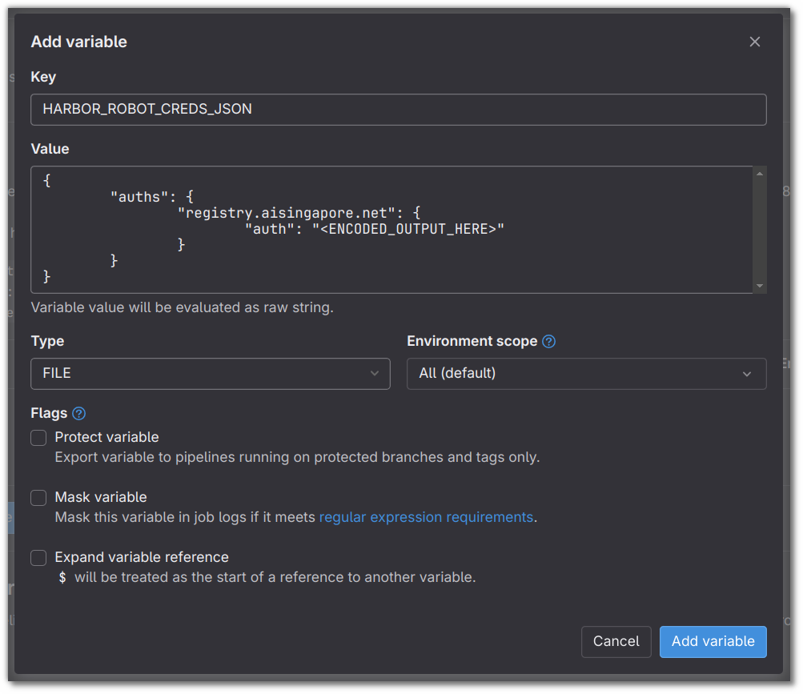

# Continuous Integration & Deployment

This template presents users with a base configuration for a GitLab
CI/CD pipeline. In this section, the guide aims to provide readers
with some basic understanding of the pipeline defined in the
configuration file `.gitlab-ci.yml`.

That being said, readers would certainly benefit from reading up on
[introductory CI/CD concepts](https://docs.gitlab.com/ee/ci/introduction/)
as introduced by GitLab's Docs.

<div class="video-wrapper">
  <iframe width="1280" height="720" src="https://www.youtube.com/embed/l5705U8s_nQ?start=392" title="YouTube video player" frameborder="0" allow="accelerometer; autoplay; clipboard-write; encrypted-media; gyroscope; picture-in-picture" allowfullscreen></iframe>
</div>

## GitHub Flow

The defined pipeline assumes a GitHub flow which only relies on
feature branches and a `main` (default) branch.


With reference to the diagram above, we have the following pointers:

- We make use of feature branches
  (`git checkout -b <NAME_OF_BRANCH>`) to introduce changes to the
  source.
- Merge requests are made when we intend to merge the commits made to a
  feature branch to `main`.
- While one works on a feature branch, it is recommended that changes
  pushed to the `main` are pulled to the feature branch itself on a
  consistent basis. This allows the feature branch to possess the
  latest changes pushed by other developers through their own feature
  branches. In the example above, commits from the `main` branch
  following a merge of the `add-hidden-layer` branch are pulled into
  the `change-training-image` branch while that branch still expects
  further changes.
- The command `git pull` can be used to pull and sync
  these changes. However, it's recommended that developers make use of
  `git fetch` and `git log` to observe incoming changes first rather
  than pulling in changes in an indiscriminate manner.
- While it's possible for commits to be made directly
  to the `main` branch, it's recommended that they are kept minimal,
  at least for GitHub flow _(other workflows might not heed such
  practices)_.

As we move along, we should be able to relate parts of the flow
described above with the stages defined by the default GitLab CI
pipeline.

## Environment Variables

Before we can make use of the GitLab CI pipeline, we would have to
define the following variable(s) for the pipeline beforehand:

- `HARBOR_ROBOT_CREDS_JSON`: A JSON formatted value that contains
  encoded credentials for a robot account on Harbor. This is to allow
  the pipeline to interact with the Harbor server. See
  [here](#docker-configuration-file-for-accessing-harbor) on how to
  generate this value/file.

To define CI/CD variables for a project (repository), follow the steps
listed
[here](https://docs.gitlab.com/ee/ci/variables/#add-a-cicd-variable-to-a-project).
The environment variable `HARBOR_ROBOT_CREDS_JSON` needs to be a `File`
type.

### Docker Configuration File for Accessing Harbor

The variable `HARBOR_ROBOT_CREDS_JSON` will be used to populate the
files `/kaniko/.docker/config.json` and `/root/.docker/config.json` for
`kaniko` and `crane` to authenticate themselves before communicating
with AI Singapore's Harbor registry. You may create the JSON file like
so:

=== "Linux/macOS"

    ```bash
    $ echo -n <HARBOR_USERNAME>:<HARBOR_PASSWORD> | base64
    <ENCODED_OUTPUT_HERE>
    ```

=== "Windows PowerShell"

    ```powershell
    $ $cred = "<HARBOR_USERNAME>:<HARBOR_PASSWORD>"
    $ $bytes = [System.Text.Encoding]::ASCII.GetBytes($cred)
    $ $base64 = [Convert]::ToBase64String($bytes)
    $ echo $base64
    <ENCODED_OUTPUT_HERE>
    ```

Using the output from above, copy and paste the following content
into a CI/CD environment variable of type `File`
(under `Settings` -> `CI/CD` -> `Variables` -> `Add variable`):

```json
{
        "auths": {
                "registry.aisingapore.net": {
                        "auth": "<ENCODED_OUTPUT_HERE>"
                }
        }
}
```



__Reference(s):__

- [GitLab Docs - GitLab CI/CD variables](https://docs.gitlab.com/ee/ci/variables/)
- [Docker Docs - Configuration files](https://docs.docker.com/engine/reference/commandline/cli/#configuration-files)

## Stages & Jobs

In the default pipeline, we have 3 stages defined:

- `test`: For every push to certain branches, the source code residing
  in `src` will be tested.
- `build`: Assuming the automated tests are passed, the pipeline
  will build Docker images, making use of the latest source.
- `deploy-docs`: This stage is for the purpose of deploying a static
  site through
  [GitLab Pages](https://docs.gitlab.com/ee/user/project/pages/).
  More on this stage is covered in
  ["Documentation"](./11-documentation.md).

These stages are defined and listed like so:

=== "`.gitlab-ci.yml`"

    ```yaml
    ...
    stages:
      - test
      - build
      - deploy-docs
    ...
    ```

The jobs for each of the stages are executed using Docker images defined
by users. For this, we have to specify in the pipeline the tag
associated with the GitLab Runner that has the
[Docker executor](https://docs.gitlab.com/runner/executors/docker.html).
In our case, the tag for the relevant runner is `dind`. The `on-prem`
tag calls for runners within our on-premise infrastructure so on-premise
services can be accessed within our pipelines.

=== "`.gitlab-ci.yml`"

    ```yaml
    default:
      tags:
        - dind
        - on-prem
    ...
    ```

## Automated Testing & Linting

Let's look at the job defined for the `test`stage first:

=== "`.gitlab-ci.yml`"

    ```yaml
    ...
    test:pylint-pytest:
      stage: test
      image:
        name: continuumio/miniconda:4.7.12
      before_script:
        - conda env create -f {{cookiecutter.repo_name}}-conda-env.yaml
        - source activate {{cookiecutter.repo_name}}
      script:
        - pylint src --fail-under=7.0 --ignore=tests --disable=W1202
        - pytest src/tests
      rules:
        - if: $CI_MERGE_REQUEST_IID
          changes:
            - src/**/*
            - conf/**/*
        - if: $CI_PIPELINE_SOURCE == "push"
        - if: $CI_COMMIT_TAG
          when: never
    ...
    ```

First of all, this `test:pylint-pytest` job will only execute on the
condition that the defined
[`rules`](https://docs.gitlab.com/ee/ci/yaml/#rules)
are met. In this case,
the job will only execute for the following cases:

- For any pushes to any branch.
- For pushes to branches which merge requests have been created,
  tests are executed only if there are changes made to any files within
  `src` or `conf` are detected. This is to prevent automated tests
  from running for pushes made to feature branches
  with merge requests when no
  changes have been made to files for which tests are relevant.
  Otherwise, tests will run in a redundant manner, slowing down the
  feedback loop.
- If the push action is associated with a tag
  (`git push <remote> <tag_name>`), the job will not run.

The job defined above fails
under any of the following conditions:

- The source code does not meet a linting score of at least 7.0.
- The source code fails whatever tests have been defined under
  `src/tests`.

The job would have to succeed before moving on to the `build` stage.
Otherwise, no Docker images will be built. This is so that source
code that fail tests would never be packaged.

__Reference(s):__

- [GitLab Docs - Predefined variables reference](https://docs.gitlab.com/ee/ci/variables/predefined_variables.html)
- [Real Python - Effective Python Testing With Pytest](https://realpython.com/pytest-python-testing/)
- [VSCode Docs - Linting Python in Visual Studio Code](https://code.visualstudio.com/docs/python/linting)

## Automated Builds

The template has thus far introduced a couple of Docker images relevant
for the team. The tags for all the Docker images are listed below:

- `{{cookiecutter.harbor_registry_project_path}}/data-prep`
- `{{cookiecutter.harbor_registry_project_path}}/model-training`

The `build` stage aims at automating the building of these Docker
images in a parallel manner. Let's look at a snippet for a single job
that builds a Docker image:

=== "`.gitlab-ci.yml`"

    ```yaml
    ...
    build:data-prep-image:
      stage: build
      image:
        name: gcr.io/kaniko-project/executor:debug
        entrypoint: [""]
      script:
        - mkdir -p /kaniko/.docker
        - cat $HARBOR_ROBOT_CREDS_JSON > /kaniko/.docker/config.json
        - >-
          /kaniko/executor
          --context "${CI_PROJECT_DIR}"
          --dockerfile "${CI_PROJECT_DIR}/docker/{{cookiecutter.repo_name}}-data-prep.Dockerfile"
          --destination "{{cookiecutter.harbor_registry_project_path}}/data-prep:${CI_COMMIT_SHORT_SHA}"
      rules:
        - if: $CI_MERGE_REQUEST_IID
          changes:
            - docker/{{cookiecutter.repo_name}}-data-prep.Dockerfile
            - src/**/*
            - conf/**/*
        - if: $CI_COMMIT_BRANCH == $CI_DEFAULT_BRANCH
    ...
    ```

!!! note
    You would have noticed that the jobs for building images utilise the
    command `/kaniko/executor` as opposed to `docker build` which most
    users would be more familiar with. This is due to the usage of
    [`kaniko`](https://github.com/GoogleContainerTools/kaniko) within a
    runner with a Docker executor. Using Docker within Docker
    ([Docker-in-Docker](https://docs.gitlab.com/ee/ci/docker/using_docker_build.html#use-docker-in-docker))
    requires privileged mode that poses several security concerns.
    Hence, the image `gcr.io/kaniko-project/executor:debug` is being
    used for all `build` jobs related to building of Docker images.
    That being said, the flags used for `kaniko` corresponds well with
    the flags usually used for `docker` commands.

Just like with the `test` job, the each of the jobs under `build`
will execute under certain conditions:

- If a push is being done to a branch which has a merge request opened,
  a check would be done to see if any changes were made to folders like
  `src`, `conf`, `scripts`, or the relevant Dockerfile itself. If there
  are changes, the job will be executed. An opened merge request is
  detected through the predefined variable `CI_MERGE_REQUEST_IID`.
- If a push is being made to the default branch (`CI_DEFAULT_BRANCH`)
  of the repo, which in
  most cases within our organisation would be `main`, the job would
  execute as well. Recalling the `test` stage, any pushes to the repo
  would trigger the automated tests and linting. If a push to the
  `main` branch passes the tests, all Docker images will be
  built, regardless of whether changes have been made to files
  relevant to the Docker images to be built themselves.

Images built through the pipeline will be tagged with the commit
hashes associated with the commits that triggered it. This is seen
through the usage of the predefined variable `CI_COMMIT_SHORT_SHA`.

__Reference(s):__

- [GitLab Docs - Use kaniko to build Docker images](https://docs.gitlab.com/ee/ci/docker/using_kaniko.html)
- [GitLab Docs - Use Docker to build Docker images](https://docs.gitlab.com/ee/ci/docker/using_docker_build.html#use-docker-in-docker)

## Tagging

As mentioned, pushes to the default branch would trigger builds for
Docker images and they would be tagged with the commit hash.
However, such commit hashes aren't the best way to tag "finalised"
Docker images so the usage of tags would be more appropriate here.
Hence, for the job defined below, it would only trigger if a tag
is pushed to the default branch and only the default branch.
The tag pushed (say through a command like `git push <remote> <tag>`)
to the default branch on the remote would have the runner
__retag__ the Docker image that exists on Harbor with the tag that is
being pushed. The relevant images to be retagged are originally tagged
with the short commit hash obtained from the commit that was pushed
to the default branch before this.

=== "`.gitlab-ci.yml`"

    ```yaml
    ...
    build:retag-images:
      stage: build
      image:
        name: gcr.io/go-containerregistry/crane:debug
        entrypoint: [""]
      script:
        - cat $HARBOR_ROBOT_CREDS_JSON > /root/.docker/config.json
        - crane auth login registry.aisingapore.net
        - crane tag {{cookiecutter.harbor_registry_project_path}}/data-prep:${CI_COMMIT_SHORT_SHA} ${$CI_COMMIT_TAG}
        - crane tag {{cookiecutter.harbor_registry_project_path}}/model-training:${CI_COMMIT_SHORT_SHA} ${$CI_COMMIT_TAG}
      rules:
        - if: $CI_COMMIT_TAG && $CI_COMMIT_BRANCH == $CI_DEFAULT_BRANCH
    ...
    ```

__Reference(S):__

- [GitHub Docs - GitHub Flow](https://docs.github.com/en/get-started/quickstart/github-flow)
- [GitLab Docs - GitLab Flow](https://docs.gitlab.com/ee/topics/gitlab_flow.html)
- [`go-containerregistry` GitHub - `crane`](https://github.com/google/go-containerregistry/blob/main/cmd/crane/README.md)

## Conclusion

The stages and jobs defined in this default pipeline is rudimentary at
best as there is much more that could be done with GitLab CI.
Some examples off the top:

- automatically generate reports for datasets that arrive in regular
  intervals
- submit model training jobs following triggers invoked by the same
  pipeline
- automate the deployment of the FastAPI servers to Kubernetes clusters

There's much more that can be done but whatever has been shared thus far
is hopefully enough for one to get started with CI/CD.
