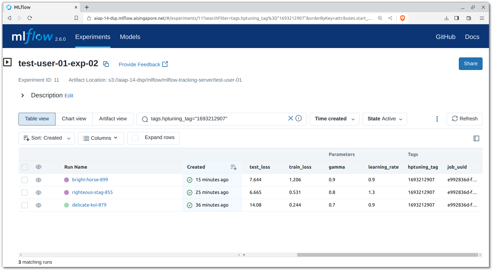

# Job Orchestration

We can set up development workspaces to execute jobs and workflows 
locally.

## Pipeline Configuration

In this template, Hydra is the configuration framework of choice for the
data preparation and model training pipelines (or any pipelines that
doesn't belong to the model serving aspects).

The configurations for logging, pipelines and hyperparameter tuning can
be found under the `conf` folder. These YAML files are then referred to 
by Hydra or general utility functions
(`src/{{cookiecutter.src_package_name}}/general_utils.py`)
for loading of parameters and configurations. The defined default 
values can be overridden through the CLI.

!!! attention
    It is recommended that you have a basic understanding of
    [Hydra]'s concepts before you move on.

??? info "Reference Link(s)"

    - [Hydra Docs - Basic Override Syntax](https://hydra.cc/docs/advanced/override_grammar/basic/)

[Hydra]: https://hydra.cc/

## Data Preparation & Preprocessing

To process the sample raw data, there are many ways to do so. One way
is to run it locally. Ensure that you have activated your Conda 
environment before running the script. More information on this can be
found [here][venv]. You can also update your configuration variables at
`conf/process_data.yaml`, specifically this section:

[venv]: ./04a-virtual-env.md

```yaml
raw_data_dir_path: "./data/raw"
processed_data_dir_path: "./data/processed"
```

After that, run the script:

=== "Linux/macOS"

    ```bash
    python src/process_data.py
    ```

=== "Windows PowerShell"

    ```powershell
    python src\process_data.py
    ```

## Model Training

Now that we have processed the raw data, we can look into training the
sentiment classification model. The script relevant for this section
is `src/train_model.py`. In this script, you can see it using some
utility functions from
`src/{{cookiecutter.src_package_name}}/general_utils.py`
as well, most notably the functions for utilising MLflow utilities for
tracking experiments. Let's set up the tooling for experiment tracking
before we start model experimentation.

!!! info "Experiment Tracking"

    In the module `src/{{cookiecutter.src_package_name}}/general_utils.py`,
    the functions `mlflow_init` and `mlflow_log` are used to initialise
    MLflow experiments as well as log information and artifacts relevant
    for a run to an `mlruns` local folder.

    ??? info "Reference Link(s)"

        - [MLflow Docs - Tracking](https://www.mlflow.org/docs/latest/tracking.html#)

To run the model training script locally, you should have your Conda 
environment activated from the data preparation stage, and update your
configuration variables at `conf/train_model.yaml`, especially this
section:

```yaml
setup_mlflow: true
mlflow_autolog: false
mlflow_tracking_uri: "./mlruns"
mlflow_exp_name: "{{cookiecutter.src_package_name_short}}"
mlflow_run_name: "train-model"
data_dir_path: "./data/processed"
dummy_param1: 1.3
dummy_param2: 0.8
```

After that, run the script:

=== "Linux/macOS"

    ```bash
    python src/train_model.py
    ```

=== "Windows PowerShell"

    ```powershell
    python src\train_model.py
    ```

This will generate the MLFlow logs and artifacts locally, of which you 
can parse it with the MLFlow UI with:

```bash
conda create -n mlflow-test mlflow
conda activate mlflow-test
mlflow server
```

!!! warning "You may not use the `{{cookiecutter.repo_name}}` Conda environment"

    You would most likely not able to use the `{{cookiecutter.repo_name}}`
    Conda environment to run `mlflow server` as the package installed
    within that environment is `mlflow-skinny`, not the fully-featured
    `mlflow` that contains the server components.

and connect to http://localhost:5000.


### Hyperparameter Tuning

For many ML problems, we would be bothered with finding the optimal
parameters to train our models with. While we are able to override the
parameters for our model training workflows, imagine having to sweep
through a distribution of values. For example, if you were to seek for
the optimal learning rate within a log space, we would have to execute
`runai submit` a myriad of times manually, just to provide the training
script with a different learning rate value each time. It is reasonable
that one seeks for ways to automate this workflow.

[Optuna][optuna] is an optimisation framework designed for ML 
use-cases. Its features includes:

- ease of modularity,
- optimisation algorithms for searching the best set of parameters,
- and [parallelisation][parallel] capabilities for faster sweeps.

In addition, Hydra has a plugin for utilising Optuna which further
translates to ease of configuration. To use Hydra's plugin for Optuna,
we have to provide further overrides within the YAML config, and this is
observed in `conf/train_model.yaml`:

```yaml
defaults:
  - override hydra/sweeper: optuna
  - override hydra/sweeper/sampler: tpe

hydra:
  sweeper:
    sampler:
      seed: 55
    direction: ["minimize", "maximize"]
    study_name: "image-classification"
    storage: null
    n_trials: 3
    n_jobs: 1
    params:
      dummy_param1: range(0.9,1.7,step=0.1)
      dummy_param2: choice(0.7,0.8,0.9)
```

These fields are used by the Optuna Sweeper plugin to configure the
Optuna study.

!!! attention
    The fields defined are terminologies used by Optuna. Therefore, it is
    recommended that you understand the basics of the tool.
    [This overview video][optuna-vid] covers well on the concepts 
    brought upon by Optuna.

    Here are the definitions for some of the fields:

    - `params` is used to specify the parameters to be tuned, and the 
      values to be searched through
    - `n_trials` specifies the number of trials to be executed
    - `n_jobs` specifies the number of trials to be executed in 
      parallel

As to how the training script would work towards training a model with
the best set of parameters, there are two important lines from two
different files that we have to pay attention to.

`src/train_model.py`
```python
...
    return args["dummy_param1"], args["dummy_param2"]
...
```

`conf/train_model.yaml`
```yaml
...
    direction: ["minimize", "maximize"]
...
```

In the training script the returned variables are to contain values
that we seek to optimise for. In this case, we seek to minimise the 
loss and maximise the accuracy. The `hydra.sweeper.direction` field in 
the YAML config is used to specify the direction that those variables 
are to optimise towards, defined in a positional manner within a list.

An additional thing to take note of is that for each trial where a
different set of parameters are concerned, a new MLflow run has to be
initialised. However, we need to somehow link all these different runs
together so that we can compare all the runs within a single Optuna
study (set of trials). How we do this is that we provide each trial 
with the same tag to be logged to MLflow (`hptuning_tag`) which would
essentially be the date epoch value of the moment you run the script.
This tag is defined using the environment value `MLFLOW_HPTUNING_TAG`.

=== "Linux/macOS"

    ```bash
    python src/train_model.py --multirun
    ```

=== "Windows PowerShell"

    ```powershell
    python src\train_model.py --multirun
    ```



??? info "Reference Link(s)"

    - [Hydra Docs - Optuna Sweeper Plugin](https://hydra.cc/docs/plugins/optuna_sweeper/)
    - [MLflow Docs - Search Syntax](https://www.mlflow.org/docs/latest/search-syntax.html)

[optuna]: https://optuna.readthedocs.io/en/stable/
[parallel]: https://optuna.readthedocs.io/en/stable/tutorial/10_key_features/004_distributed.html
[optuna-vid]: https://www.youtube.com/watch?v=P6NwZVl8ttc
