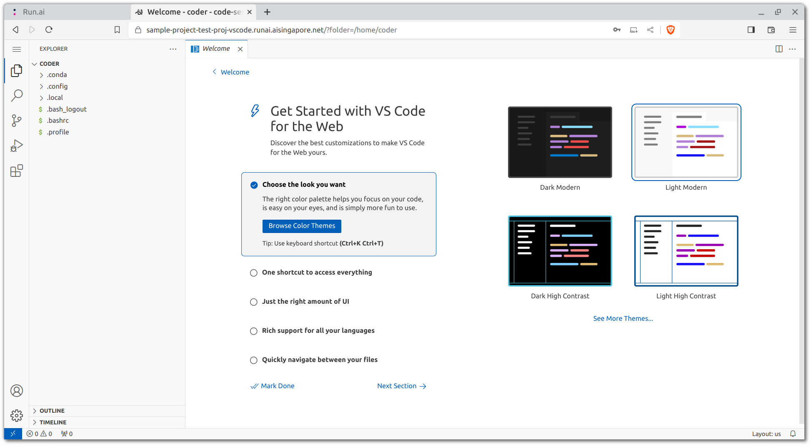

# Development Workspace

An advantage presented by orchestration platforms is that you can
utilise the Kubernetes cluster's resources for your development and
engineering works instead of your own resources.

We can make use of [Coder][coder] to spin up VSCode servers with which 
cluster resources can be dedicated.

[coder]: https://coder.com/

## VSCode

### Prebuilt VSCode Server

The MLOps team should have spun up a Coder instance in the cluster and 
handed the URL to you. The only thing you would need to do is to log 
into Coder with OpenID Connect:


Once you're in, you should be seeing something similar to this:


If you do not see a workspace running, or you could not access the 
Coder workspace allocated to you, you can contact the MLOps team.

If you have the permissions, you could also create a workspace on your 
own. The template you have access to will only work for one workspace 
at a time, so you could switch out workspaces with different CPU and 
RAM resources, depending on the needs of your team's project 
requirements.

Recommended settings for your first time are as follows:

- __Workspace Name:__ `<YOUR_HYPHENATED_NAME>-vscode`
- CPU: 2 Cores
- Memory: 4GB


If all of it runs normally, you should have two buttons: VS Code 
Desktop and code-server. Click on the latter to start running the 
remote VSCode Workspace.


You should be directed to the VSCode server welcome tab without 
password prompt.



### Persistent Workspaces

As mentioned, a PVC should be attached to the workspaces to persist
changes to the filesystems. You can use the following command to search
for the PVC:

=== "VSCode Server Terminal"

    ```bash
    ls -la / | grep "pvc"
    ```

??? info "Reference Link(s)"

    - [Kubernetes Docs - Persistent Volumes](https://kubernetes.io/docs/concepts/storage/persistent-volumes)

If there's no result, check with the MLOps team about this.

By default, the PVCs would contain a `workspaces` directory with which
you can create a subdirectory for yourself treat it as your own 
personal workspace, where all your work and other relevant assets can 
be persisted.

=== "VSCode Server Terminal"

    ```bash
    cd /<PVC_LOCATION>/workspaces
    mkdir <YOUR_HYPHENATED_NAME>
    ```

### Git from VSCode

Git by default is installed in the VSCode server image. One thing to
take note is that as the persistent storage would be accessible by the
rest of your project team members, __you should only use the `HTTPS`
protocol to clone the repository__ as opposed to creating and using an
`SSH` key within the VSCode server.

Now, let's clone your repository from the remote:

=== "VSCode Server Terminal"

    ```bash
    cd /<PVC_LOCATION>/workspaces/<YOUR_HYPHENATED_NAME>
    git clone <REMOTE_URL_HTTPS>
    cd {{cookiecutter.repo_name}}
    ```

### Extensions for VSCode

You can install a multitude of extensions for your VSCode service but
there are a couple that would be crucial for your workflow, especially
if you intend to use Jupyter notebooks within the VSCode environment.

- [`ms-python.python`][vsx-python]: Official extension by Microsoft for
  rich support for many things Python.
- [`ms-toolsai.jupyter`][vsx-jy]: Official extension by Microsoft 
  for Jupyter support.

!!! warning "Manual Installation"
    For some clusters, you may need to install the extensions manually
    due to firewall issues. If that is the case, you can download the
    extension(s) through your local machine and upload them to the 
    VSCode terminal. From there, you can make use of the following 
    command:
    ```
    $ code-server --install-extension /path/to/extension.vsix
    ```

!!! warning "Attention"
    Do head over [here][jy-vscode] on how to enable the usage of 
    virtual `conda` environments within VSCode.

[vsx-python]: https://marketplace.visualstudio.com/items?itemName=ms-python.python
[vsx-jy]: https://marketplace.visualstudio.com/items?itemName=ms-toolsai.jupyter
[jy-vscode]: ./05-virtual-env.md#jupyter-kernel-for-vscode

## Using Docker within Kubernetes

!!! caution
    Since these development environments are essentially pods deployed
    within a Kubernetes cluster, using Docker within the pods
    themselves is not feasible by default and while possible, should
    be avoided.

??? info "Reference Link(s)"

    - [Using Docker-in-Docker for your CI or testing environment? Think twice. - jpetazzo](https://jpetazzo.github.io/2015/09/03/do-not-use-docker-in-docker-for-ci/)