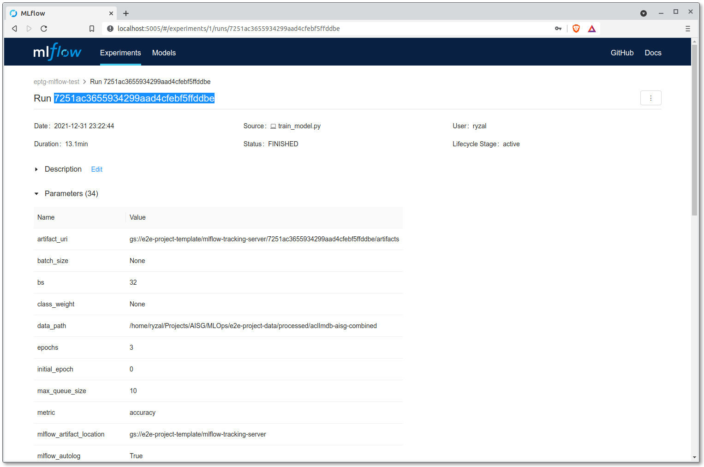
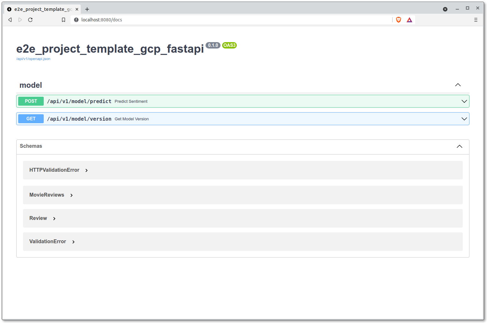

# Deployment

Assuming we have a predictive model that we are satisfied with, we can
serve it within a REST API service with which requests can be made to
and predictions are returned.

Python has plenty of web frameworks that we can leverage on to build
our REST API. Popular examples include [Flask], [Django] and 
[Starlette]. For this guide however, we will resort to the well-known 
[FastAPI] (which is based on Starlette itself).

??? info "Reference Link(s)"

    - [IBM Technology - What is a REST API? (Video)](https://www.youtube.com/watch?v=lsMQRaeKNDk)

[Flask]: https://flask.palletsprojects.com/
[Django]: https://www.djangoproject.com/
[Starlette]: https://www.starlette.io/
[FastAPI]: https://fastapi.tiangolo.com/

## Model Artifacts


    
    

    
    


Seen in ["Model Training"][train], we have the trained models uploaded
to {{objstg}} through the MLflow Tracking server (done through 
autolog). With that, we have the following pointers to take note of:

- By default, each MLflow experiment run is given a unique ID.
- When artifacts are uploaded to {{objstg}} through MLflow, the 
  artifacts are located within directories named after the unique IDs 
  of the runs.
- There are two ways to download the artifacts:
    - We can use the {{cli}} CLI to download the predictive model from 
      {{objstg}}. Artifacts for specific runs will be uploaded to a 
      directory with a convention similar to the following:
      `<MLFLOW_EXPERIMENT_ARTIFACT_LOCATION>/<MLFLOW_RUN_UUID>/artifacts`.
    - Alternatively, we can utilise the MLFlow Client library to 
      retrieve the predictive model. This model can then be propagated 
      into a mounted volume when we run the Docker image for the REST 
      APIs. __We will be recommending this method in this guide.__

[train]: ./07-job-orchestration.md#model-training

## Model Serving (FastAPI)

FastAPI is a web framework that has garnered much popularity in recent
years due to ease of adoption with its comprehensive tutorials, type
and schema validation, being async capable and having automated docs,
among other things. These factors have made it a popular framework
within AI Singapore across many projects.

If you were to inspect the `src` folder, you would notice that there
exists more than one package:

- `{{cookiecutter.src_package_name}}`
- `{{cookiecutter.src_package_name}}_fastapi`

The former contains the modules for executing pipelines like data 
preparation and model training while the latter is dedicated to modules 
meant for the REST API. Regardless, the packages can be imported by 
each other.

!!! note
    It is recommended that you grasp some basics of the FastAPI
    framework, up till the [beginner tutorials] for better 
    understanding of this section.

Let's try running the boilerplate API server on a local machine. Before
doing that, identify from the MLflow dashboard the unique ID of the
experiment run that resulted in the predictive model that you would
like to serve.



With reference to the example screenshot above, the UUID for the 
experiment run is `7251ac3655934299aad4cfebf5ffddbe`. Once the ID of 
the MLflow run has been obtained, let's download the model that we 
intend to serve. Assuming you're in the root of this template's 
repository, execute the following commands:

=== "VSCode Server Terminal"

    ```bash
    conda activate {{cookiecutter.repo_name}}
    export MODEL_UUID=<MLFLOW_RUN_UUID>
    export MLFLOW_TRACKING_URI=<MLFLOW_TRACKING_URI>
    export MLFLOW_TRACKING_USERNAME=<MLFLOW_TRACKING_USERNAME> # If applicable
    export MLFLOW_TRACKING_PASSWORD=<MLFLOW_TRACKING_PASSWORD> # If applicable
    python -c "import mlflow; mlflow.artifacts.download_artifacts(artifact_uri='runs:/$MODEL_UUID/', dst_path='models/$MODEL_UUID')"
    ```

=== "Using Run:ai"

    ```bash
    export MODEL_UUID=<MLFLOW_RUN_UUID>
    runai submit \
        --job-name-prefix <YOUR_HYPHENATED_NAME>-download-artifacts \
        -i {{cookiecutter.registry_project_path}}/cpu:0.1.0 \
        --working-dir /<NAME_OF_DATA_SOURCE>/workspaces/<YOUR_HYPENATED_NAME> \
        --existing-pvc claimname=<NAME_OF_DATA_SOURCE>,path=/<NAME_OF_DATA_SOURCE> \
        --cpu 2 --cpu-limit 2 --memory 4G --memory-limit 4G --backoff-limit 1 \
        -e MLFLOW_TRACKING_URI=<MLFLOW_TRACKING_URI> \
        -e MLFLOW_TRACKING_USERNAME=<YOUR_MLFLOW_USERNAME> \
        -e MLFLOW_TRACKING_PASSWORD=<YOUR_MLFLOW_PASSWORD> \
        --command -- python -c "import mlflow; mlflow.artifacts.download_artifacts(artifact_uri='runs:/$MODEL_UUID/', dst_path='models/$MODEL_UUID')"
    ```

Executing the commands above will download the artifacts related to the
experiment run `<MLFLOW_RUN_UUID>` to this repository's subdirectory 
`models`. However, the specific subdirectory that is relevant for our 
modules to load will be `./models/<MLFLOW_RUN_UUID>/output.txt`.

Now, let's proceed and spin up an inference server using the package 
that exists within the repository.

[beginner tutorials]: https://fastapi.tiangolo.com/tutorial/

### Running the API Server

Run the FastAPI server using [Gunicorn](https://gunicorn.org):

=== "VSCode Server Terminal"

    ```bash
    # Running in a working `{{cookiecutter.repo_name}}` repository
    conda activate {{cookiecutter.repo_name}}
    export MODEL_UUID=<MLFLOW_RUN_UUID>
    gunicorn {{cookiecutter.src_package_name}}_fastapi.main:APP \
        -k uvicorn.workers.UvicornWorker \
        -b 0.0.0.0:8080 -w 2 -t 90 --chdir src
    ```

    And with that, the link to our document site for our server would
    be given by Coder at the bottom right notification, or under the 
    Ports tab right beside the Terminal tab. The link should look
    similar to this:

=== "Using Run:ai"

    ```bash
    export MODEL_UUID=<MLFLOW_RUN_UUID>
    runai submit \
        --job-name-prefix <YOUR_HYPHENATED_NAME>-inference \
        -i {{cookiecutter.registry_project_path}}/gpu:0.1.0 \
        --working-dir /home/aisg/{{cookiecutter.repo_name}}/src \
        --existing-pvc claimname=<NAME_OF_DATA_SOURCE>,path=/<NAME_OF_DATA_SOURCE> \
        --cpu 2 --cpu-limit 2 --memory 4G --memory-limit 4G --backoff-limit 1 \
        --service-type external-url,port=8080:8080 \
        --command -- gunicorn {{cookiecutter.repo_name}}_fastapi.main:APP \
            -k uvicorn.workers.UvicornWorker \
            -b 0.0.0.0:8080 -w 2 -t 90
    ```

    And with that, the link to our document site for our server would
    be given by Run:ai. The link should look similar to this:



In another terminal, use the `curl` command to submit a request to the API:

=== "VSCode Server Terminal"

    ```bash
    curl -X POST \
        localhost:8080/api/v1/model/predict \
        -H 'Content-Type: application/json' \
        -d '"string"'
    ```
  
Output sample:

```
{"data":[{"input":"string"}]}
```

With the returned JSON object, we have successfully submitted a request
to the FastAPI server and it returned predictions as part of the
response.

[reason]: https://fastapi.tiangolo.com/deployment/server-workers/
[uvicorn]: https://www.uvicorn.org/

### Pydantic Settings

Now you might be wondering, how does the FastAPI server knows the path
to the model for it to load? FastAPI utilises [Pydantic], a library for 
data and schema validation, as well as [settings management]. There's a 
class called `Settings` under the module
`src/{{cookiecutter.src_package_name}}_fastapi/config.py`. This class 
contains several fields: some are defined and some others not. The 
field `MODEL_UUID` inherit their values from the environment variables.

`src/{{cookiecutter.src_package_name}}_fastapi/config.py`:
```python
...
class Settings(pydantic_settings.BaseSettings):

    API_NAME: str = "{{cookiecutter.src_package_name}}_fastapi"
    API_V1_STR: str = "/api/v1"
    LOGGER_CONFIG_PATH: str = "../conf/logging.yaml"

    MODEL_UUID: str
...
```

FastAPI automatically generates interactive API documentation for easy
viewing of all the routers/endpoints you have made available for the
server. You can view the documentation through
`<API_SERVER_URL>:<PORT>/docs`. 

??? info "Reference Link(s)"

    - [PyTorch Tutorials - Saving and Loading Models](https://pytorch.org/tutorials/beginner/saving_loading_models.html)
    - [FastAPI Docs](https://fastapi.tiangolo.com)
    - [Pydantic Docs - Settings Management](https://pydantic-docs.helpmanual.io/usage/settings/)
    - [`curl` tutorial](https://curl.se/docs/manual.html)

[Pydantic]: https://pydantic-docs.helpmanual.io/
[settings management]: https://fastapi.tiangolo.com/advanced/settings/?h=env#pydantic-settings
